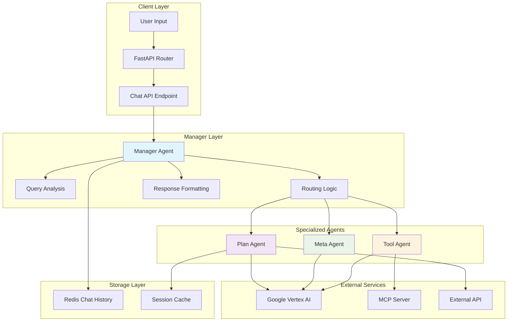

# Kiến Trúc Tổng Quan - MAS-Planning System

## 🏗️ Tổng quan hệ thống

MAS-Planning (Multi-Agent Smart Home Planning) là một hệ thống multi-agent automation cho smart home sử dụng kiến trúc hiện đại với các công nghệ tiên tiến như Model Context Protocol (MCP), Google Cloud Vertex AI, và LangGraph StateGraph.

## 🎯 Mục tiêu chính

### 1. **Sinh kế hoạch thông minh**
- Tạo kế hoạch ưu tiên từ input đa dạng (camera phát hiện, sensor data, voice command)
- Phân loại theo 3 loại ưu tiên: Security, Convenience, Energy Efficiency
- Tích hợp AI để tối ưu hóa quyết định

### 2. **Phân rã nhiệm vụ intelligent**
- MetaAgent phân tích và chia nhỏ kế hoạch phức tạp thành các tasks cụ thể
- Context-aware task decomposition
- Dependency management giữa các tasks

### 3. **Thực thi tự động**
- ToolAgent gọi MCP tools để điều khiển thiết bị real-time
- Support đa dạng thiết bị: đèn, điều hòa, loa, camera, sensors
- Error handling và retry mechanisms

### 4. **Theo dõi trạng thái**
- API integration để upload plans và track task status
- Real-time monitoring workflow execution
- Comprehensive logging và reporting

### 5. **Workflow orchestration**
- LangGraph StateGraph quản lý luồng phức tạp giữa các agent
- State management và persistence
- Asynchronous processing support

## 🏛️ Kiến trúc Multi-Agent



## 🔧 Cấu trúc thành phần chính

### 1. **Manager Agent** (Coordinator)
- **Vai trò**: Central coordinator và entry point cho toàn bộ hệ thống
- **Chức năng**:
  - Phân tích và phân loại user queries
  - Routing decisions thông minh
  - Orchestration multi-agent workflows
  - Response formatting và user interaction
- **Technology**: LangGraph StateGraph, Conversation History

### 2. **Plan Agent** (Strategic Planner)
- **Vai trò**: Tạo và quản lý smart home automation plans
- **Chức năng**:
  - Generate 3 priority-based plans (Security, Convenience, Energy)
  - Plan selection handling
  - API integration cho plan persistence
  - Task execution orchestration
- **Technology**: StateGraph workflows, API integration

### 3. **Meta Agent** (Analytical Processor)
- **Vai trò**: Phân tích và xử lý tasks phức tạp
- **Chức năng**:
  - Task decomposition và analysis
  - Context-aware reasoning
  - XML parsing cho structured data
  - Strategic decision making
- **Technology**: Advanced prompting, XML processing

### 4. **Tool Agent** (Execution Engine)
- **Vai trò**: Thực thi concrete actions thông qua MCP tools
- **Chức năng**:
  - MCP tools integration
  - Device control và automation
  - Authentication handling (token-based)
  - Real-time device interaction
- **Technology**: Model Context Protocol (MCP), async processing

## 🔄 Workflow luồng xử lý

### 1. **Input Processing Flow**
```
User Input → Manager Agent → Query Analysis → Routing Decision
```

### 2. **Plan Creation Flow**
```
Plan Request → Plan Agent → LLM Generation → 3 Priority Plans → User Selection
```

### 3. **Plan Execution Flow**
```
Selected Plan → Meta Agent Analysis → Tool Agent Execution → Status Updates → Completion
```

### 4. **Device Control Flow**
```
Control Command → Tool Agent → MCP Server → Device API → Action Result
```

## 🏗️ Thiết kế kiến trúc

### **Separation of Concerns**
- **Manager**: Orchestration và user interaction
- **Plan**: Strategic planning và workflow management
- **Meta**: Analysis và reasoning
- **Tool**: Concrete execution và device control

### **Scalability Design**
- Lazy loading của sub-agents để optimize memory
- Session-based caching cho plan persistence
- Asynchronous processing cho MCP tools
- Event-driven architecture với LangGraph

### **Reliability Features**
- Comprehensive error handling ở mọi layer
- Fallback mechanisms khi services unavailable
- Timeout handling cho external calls
- Retry logic cho critical operations

### **Security Architecture**
- Token-based authentication cho MCP tools
- Environment variables cho sensitive data
- No automatic credential handling
- Secure API communication

## 📊 State Management

### **Manager State**
- User input và conversation context
- Routing decisions và confidence scores
- Agent delegation results
- Final response formatting

### **Plan State**
- Plan generation và selection status
- Cached plan options
- Execution progress tracking
- API integration status

### **Tool State**
- MCP tool availability
- Authentication tokens
- Device control results
- Error handling states

## 🔌 External Integrations

### **Google Cloud Vertex AI**
- LLM cho tất cả agents (Gemini 2.5 Pro)
- Multi-modal AI capabilities
- Scalable cloud processing
- Advanced reasoning capabilities

### **Model Context Protocol (MCP)**
- Standardized tool integration
- Device control abstraction
- Extensible tool ecosystem
- Real-time communication

### **External APIs**
- Plan persistence và tracking
- Status updates và monitoring
- Integration với third-party services
- Webhook support cho notifications

### **Redis Storage**
- Conversation history persistence
- Session management
- Caching layer cho performance
- TTL-based data lifecycle

## 🚀 Performance Optimizations

### **Lazy Loading**
- Sub-agents chỉ được load khi cần thiết
- Memory optimization
- Faster startup times
- Resource efficiency

### **Caching Strategy**
- Plan options caching cho user selections
- Conversation history với TTL
- MCP tools caching
- Response caching cho repeated queries

### **Asynchronous Processing**
- Non-blocking MCP tool calls
- Concurrent agent processing
- Background task execution
- Scalable request handling

## 🔐 Security & Compliance

### **Authentication**
- Token-based MCP authentication
- No password storage
- Secure credential management
- API key protection

### **Data Privacy**
- Conversation history với TTL
- No persistent user data storage
- Encrypted communication
- GDPR compliance ready

### **Error Handling**
- Graceful degradation
- No sensitive data trong error messages
- Comprehensive logging
- Security incident tracking

## 📈 Monitoring & Observability

### **Logging Strategy**
- Structured logging với timestamps
- Agent-specific log namespaces
- Error tracking và alerting
- Performance metrics collection

### **Health Checks**
- System status endpoints
- Agent availability monitoring
- External service health checks
- Automatic recovery mechanisms

### **Metrics Collection**
- Response times per agent
- Success/failure rates
- Resource utilization tracking
- User interaction analytics

## 🔮 Future Architecture Considerations

### **Scalability Enhancements**
- Microservices migration path
- Container orchestration ready
- Horizontal scaling capabilities
- Load balancing strategies

### **AI/ML Improvements**
- Model fine-tuning capabilities
- Adaptive learning mechanisms
- Personalization features
- Advanced reasoning pipelines

### **Integration Expansions**
- More MCP tool providers
- Voice interface integration
- Mobile app support
- IoT ecosystem expansion

---

*Tài liệu này cung cấp cái nhìn tổng quan về kiến trúc MAS-Planning system. Để hiểu rõ hơn về từng component, vui lòng tham khảo các tài liệu chuyên sâu về từng Agent.*