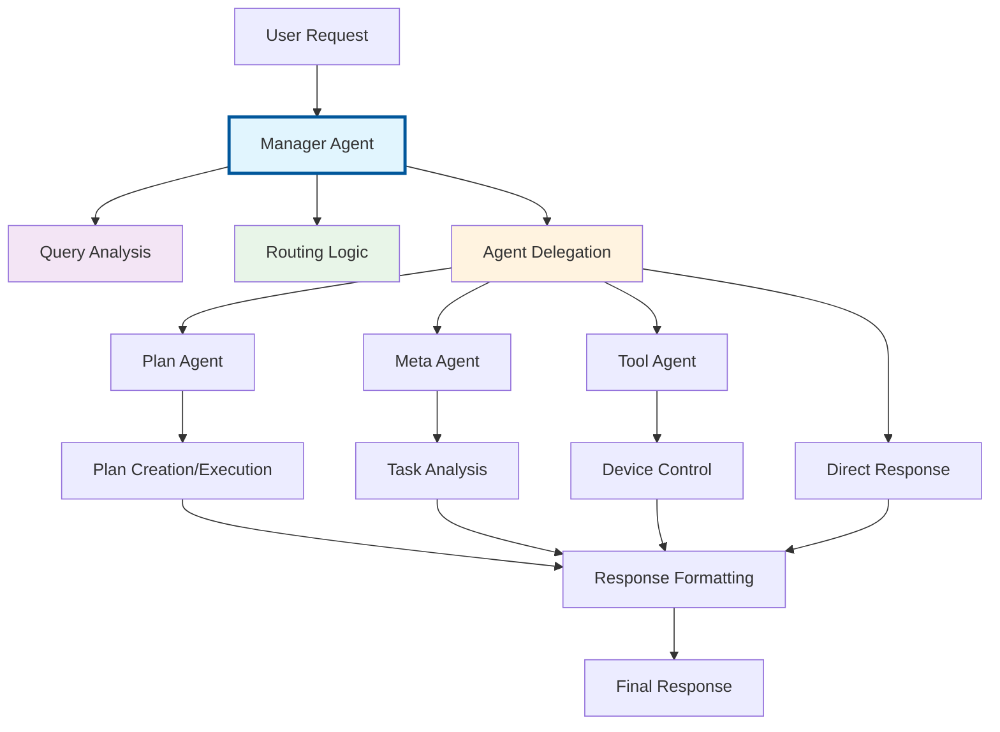
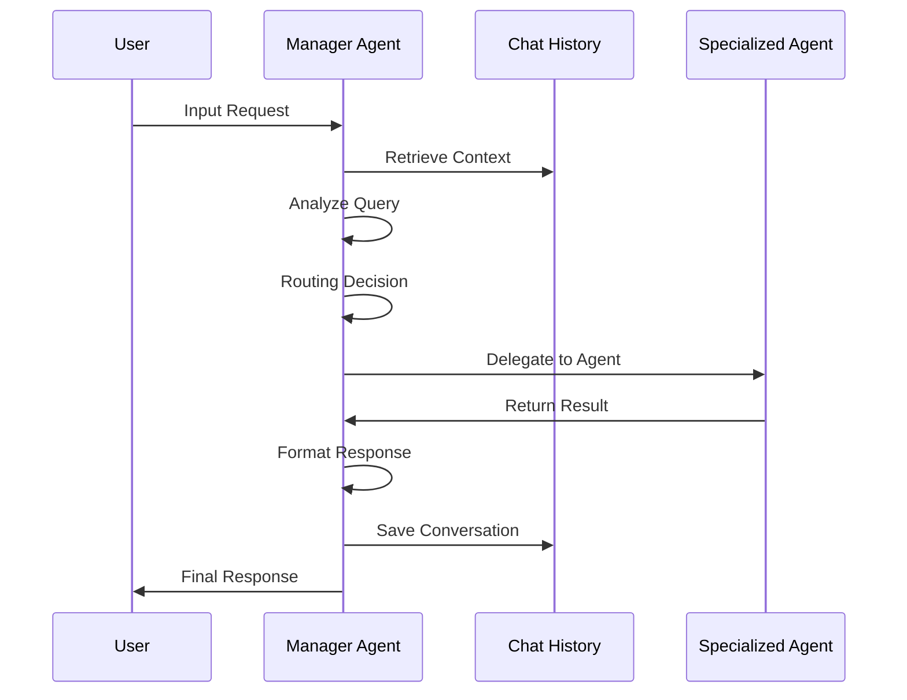
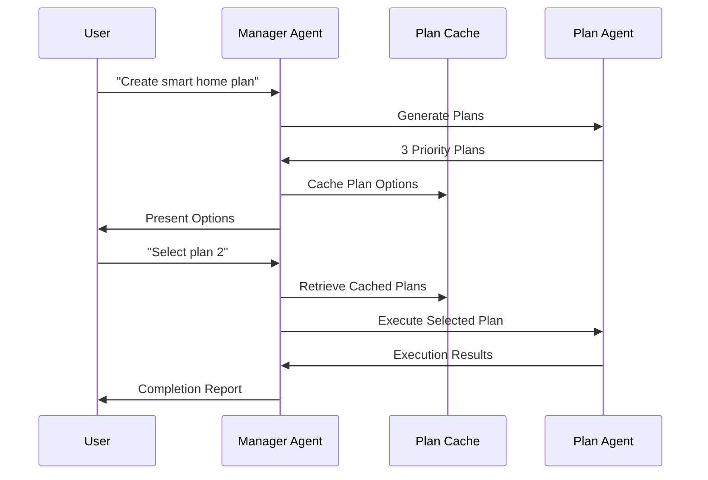
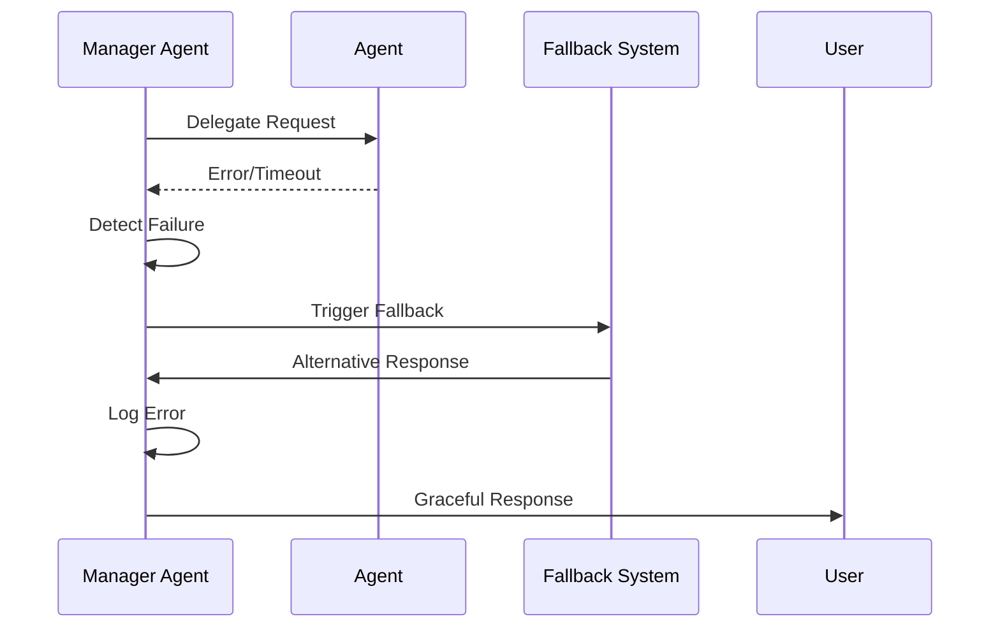

# Manager Agent - Trung tâm điều phối hệ thống

## 🎯 Tổng quan

**Manager Agent** là thành phần trung tâm và điểm vào chính của hệ thống MAS-Planning. Nó đóng vai trò như một conductor trong dàn nhạc, orchestrating và điều phối hoạt động của tất cả các specialized agents khác.

## 🏗️ Kiến trúc và Vị trí



## 🎯 Vai trò và Trách nhiệm

### **Primary Responsibilities**

1. **Query Analysis & Classification**
   - Phân tích ý định người dùng từ natural language input
   - Phân loại query types (planning, control, information, selection)
   - Context-aware analysis sử dụng conversation history

2. **Intelligent Routing**
   - Quyết định agent nào phù hợp nhất cho từng request
   - Load balancing và resource optimization
   - Fallback routing khi primary analysis fails

3. **Multi-Agent Orchestration**
   - Coordinating workflows giữa specialized agents
   - Managing agent lifecycle và resource allocation
   - Handling complex multi-step processes

4. **Session Management**
   - Duy trì conversation context và history
   - Plan options caching cho user selections
   - State persistence across interactions

5. **Response Formatting**
   - Chuẩn hóa responses từ different agents
   - User-friendly output formatting
   - Error handling và graceful degradation

## 🧠 Core Components

### **1. Query Analysis Engine**

```python
def analyze_query(self, state: ManagerState) -> ManagerState:
    """
    Phân tích query với conversation context
    """
    # Build context từ chat history
    messages = [SystemMessage(self.system_prompt)]
    
    # Add recent conversation history
    if self.chat_history.messages:
        recent_messages = self.chat_history.messages[-6:]
        for msg in recent_messages:
            # Convert to appropriate message format
            
    # Add current query
    messages.append(HumanMessage(f"Current User Query: {user_input}"))
    
    # LLM analysis
    llm_response = self.llm.invoke(messages)
    reasoning_result = extract_manager_response(llm_response.content)
```

**Features:**
- **Context-Aware Analysis**: Sử dụng 6 tin nhắn gần nhất làm context
- **Confidence Scoring**: Đánh giá độ tin cậy của routing decisions
- **Multi-factor Classification**: Kết hợp keyword matching và semantic analysis

### **2. Intelligent Routing System**

```python
def _context_aware_fallback_routing(self, query: str) -> str:
    """
    Enhanced fallback routing với conversation context
    """
    # Priority 1: Explicit keywords
    if any(word in query_lower for word in ['create plan', 'plan']):
        return 'plan'
    
    # Priority 2: Conversation context analysis
    if self.chat_history.messages:
        recent_messages = self.chat_history.messages[-4:]
        # Analyze patterns in recent conversation
        
    # Priority 3: Standard keyword-based routing
    return self._fallback_routing(query)
```

**Routing Strategy:**
- **Plan Agent**: Plan creation, selection, automation requests
- **Tool Agent**: Device control, immediate actions
- **Meta Agent**: Analysis, reasoning, complex questions  
- **Direct Response**: Information queries, help requests

### **3. Agent Delegation Framework**

```python
def route_to_agent(self, state: ManagerState) -> ManagerState:
    """
    Route và delegate requests to appropriate agents
    """
    agent_type = state.get('agent_type', 'direct')
    
    if agent_type == 'plan':
        # Handle plan creation/selection with caching
        if plan_selection and self._cached_plan_options:
            delegation_result = self.plan_agent.invoke(
                user_input, 
                selected_plan_id=plan_selection,
                plan_options=self._cached_plan_options,
                token=token
            )
        else:
            delegation_result = self.plan_agent.invoke(user_input, token=token)
```

**Delegation Features:**
- **Lazy Loading**: Agents chỉ được khởi tạo khi cần thiết
- **Resource Management**: Optimal memory và CPU usage
- **Error Recovery**: Graceful handling khi agents fail
- **Result Validation**: Ensuring output quality và format consistency

### **4. Session State Management**

```python
class ManagerAgent:
    def __init__(self, session_id: str, conversation_id: str):
        # Chat history cho conversation context
        self.chat_history = RedisSupportChatHistory(
            session_id=session_id,
            conversation_id=conversation_id,
            ttl=env.TTL_SECONDS
        )
        
        # Cached plan options for user selections
        self._cached_plan_options = {}
```

**State Components:**
- **Conversation History**: Redis-backed persistent storage
- **Plan Options Cache**: In-memory caching cho quick selections
- **Session Context**: User preferences và interaction patterns
- **Agent States**: Tracking specialized agent statuses

## 🔄 Workflow Processing

### **1. Standard Request Flow**



### **2. Plan Selection Flow**



### **3. Error Recovery Flow**



## 🧩 Integration Patterns

### **1. Lazy Agent Loading**

```python
@property
def plan_agent(self):
    """Lazy load Plan Agent with async initialization"""
    if self._plan_agent is None:
        from template.agent.plan import PlanAgent
        self._plan_agent = PlanAgent(verbose=self.verbose)
        
        # Async initialization in separate thread
        def run_async_init():
            loop = asyncio.new_event_loop()
            asyncio.set_event_loop(loop)
            try:
                loop.run_until_complete(self._plan_agent.init_async())
            finally:
                loop.close()
        
        thread = threading.Thread(target=run_async_init)
        thread.start()
        thread.join(timeout=10)
```

**Benefits:**
- **Memory Efficiency**: Chỉ load agents khi cần
- **Faster Startup**: Reduced initial loading time
- **Resource Optimization**: Better CPU và memory utilization

### **2. Conversation Context Integration**

```python
def analyze_query(self, state: ManagerState) -> ManagerState:
    """Context-aware query analysis"""
    # Add conversation history for context
    if self.chat_history.messages:
        recent_messages = self.chat_history.messages[-6:]
        
        for msg in recent_messages:
            if 'Human' in msg.__class__.__name__:
                messages.append(HumanMessage(f"Previous User: {content}"))
            elif 'AI' in msg.__class__.__name__:
                messages.append(SystemMessage(f"Previous AI: {content}"))
```

**Context Features:**
- **Historical Awareness**: Understanding conversation flow
- **Intent Persistence**: Maintaining user goals across interactions
- **Adaptive Responses**: Tailoring replies based on conversation history

### **3. Token-based Authentication Flow**

```python
def invoke(self, input_data: Dict[str, Any]) -> Dict[str, Any]:
    """Main entry point with token handling"""
    state = {
        'input': user_message,
        'token': input_data.get('token', ''),
        # ... other state data
    }
    
    # Pass token to agents that need authentication
    if agent_type == 'tool':
        tool_input = {
            'input': user_input,
            'token': token
        }
        delegation_result = self.tool_agent.invoke(tool_input)
```

## 📊 Performance Optimizations

### **1. Caching Strategy**

- **Plan Options Cache**: TTL-based in-memory storage
- **Conversation History**: Redis-backed với configurable TTL
- **Agent Results**: Temporary caching cho repeated queries
- **LLM Responses**: Selective caching cho common patterns

### **2. Resource Management**

- **Agent Lifecycle**: Lazy loading và resource cleanup
- **Memory Optimization**: Efficient state management
- **Connection Pooling**: Reusing database connections
- **Async Processing**: Non-blocking operations where possible

### **3. Response Time Optimization**

- **Parallel Processing**: Concurrent analysis where applicable
- **Preemptive Loading**: Predictive agent initialization
- **Response Streaming**: Immediate feedback cho long operations
- **Timeout Management**: Preventing hanging requests

## 🔒 Security Features

### **1. Input Validation**

```python
def invoke(self, input_data: Dict[str, Any]) -> Dict[str, Any]:
    """Validate and sanitize inputs"""
    if isinstance(input_data, dict):
        user_message = input_data.get('message', '') or input_data.get('input', '')
    else:
        user_message = str(input_data)
    
    # Input validation và sanitization
    # Token validation
    # Rate limiting checks
```

### **2. Secure Token Handling**

- **No Token Storage**: Tokens are passed through, never stored
- **Secure Transmission**: Encrypted communication channels
- **Token Validation**: Verification before delegation
- **Access Control**: Role-based permissions

### **3. Error Information Security**

- **Sanitized Error Messages**: No sensitive data in user responses
- **Secure Logging**: Protected error logs with rotation
- **Audit Trail**: Comprehensive access logging
- **Privacy Protection**: User data anonymization

## 📈 Monitoring và Diagnostics

### **1. Performance Metrics**

```python
def invoke(self, input_data: Dict[str, Any]) -> Dict[str, Any]:
    """Main invoke với performance tracking"""
    start_time = time.time()
    
    try:
        result = self.graph.invoke(state)
        execution_time = time.time() - start_time
        
        if self.verbose:
            logger.info(f"✅ Request processed in {execution_time:.2f}s")
            
        return {
            'execution_time': execution_time,
            'success': True,
            # ... other response data
        }
```

### **2. Health Checks**

```python
def get_system_status(self) -> Dict[str, Any]:
    """System health status"""
    return {
        'manager_status': 'active',
        'sub_agents': {
            'plan_agent': self._plan_agent is not None,
            'meta_agent': self._meta_agent is not None,
            'tool_agent': self._tool_agent is not None
        },
        'cached_plans': len(self._cached_plan_options) > 0,
        'capabilities': get_agent_capabilities()
    }
```

### **3. Debugging Support**

- **Verbose Logging**: Detailed execution tracing
- **State Inspection**: Runtime state debugging
- **Agent Communication**: Inter-agent message tracking
- **Performance Profiling**: Execution bottleneck identification

## 🔮 Advanced Features

### **1. Adaptive Learning**

- **Pattern Recognition**: Learning từ user interaction patterns
- **Preference Modeling**: Adapting to user preferences over time
- **Success Rate Optimization**: Improving routing accuracy
- **Predictive Routing**: Anticipating user needs

### **2. Multi-Modal Support**

- **Text Processing**: Natural language understanding
- **Voice Integration**: Speech-to-text support ready
- **Visual Input**: Image analysis capabilities (future)
- **Gesture Recognition**: Motion-based commands (future)

### **3. Extensibility Framework**

- **Plugin Architecture**: Easy agent integration
- **Custom Routing Rules**: Configurable routing logic
- **External Service Integration**: API và webhook support
- **Custom Response Formatters**: Flexible output customization

## 🚀 Best Practices

### **1. Development Guidelines**

- **Separation of Concerns**: Clear responsibility boundaries
- **Error Handling**: Comprehensive exception management
- **Testing Strategy**: Unit và integration testing
- **Documentation**: Inline comments và API documentation

### **2. Performance Guidelines**

- **Resource Optimization**: Efficient memory và CPU usage
- **Caching Strategy**: Strategic data caching
- **Connection Management**: Proper resource cleanup
- **Monitoring**: Continuous performance tracking

### **3. Security Guidelines**

- **Input Validation**: Always validate user inputs
- **Secure Communication**: Use encrypted channels
- **Access Control**: Implement proper permissions
- **Audit Logging**: Comprehensive security logging

---

*Manager Agent là trái tim của hệ thống MAS-Planning, đảm bảo tất cả components hoạt động harmony để cung cấp experience tốt nhất cho users. Để hiểu sâu hơn về các specialized agents, vui lòng tham khảo tài liệu riêng của từng agent.*