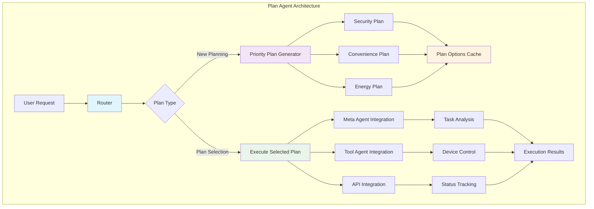
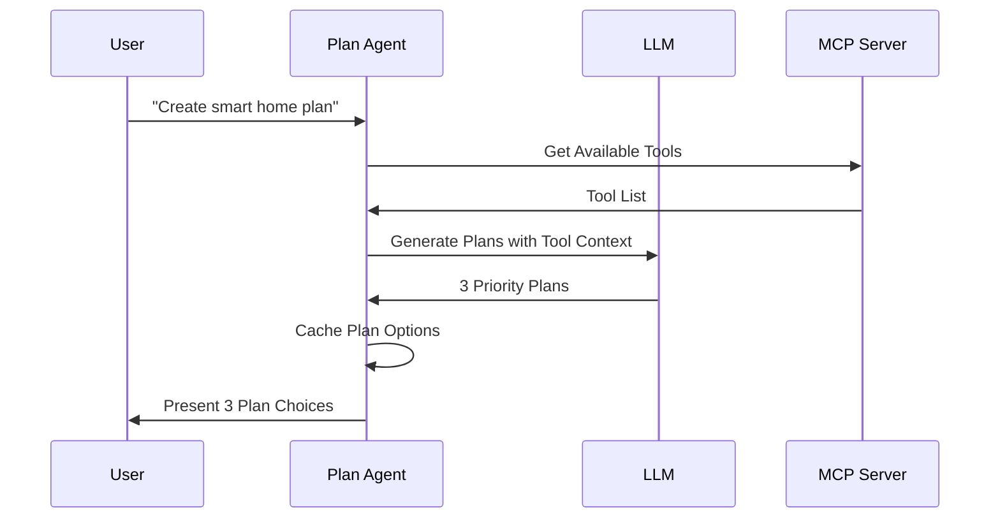
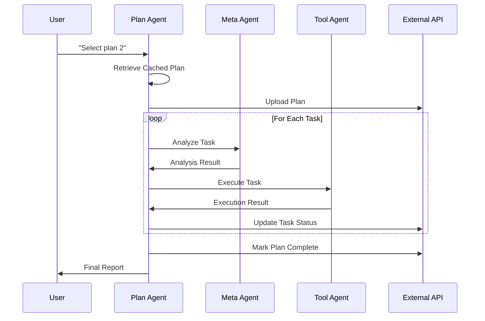
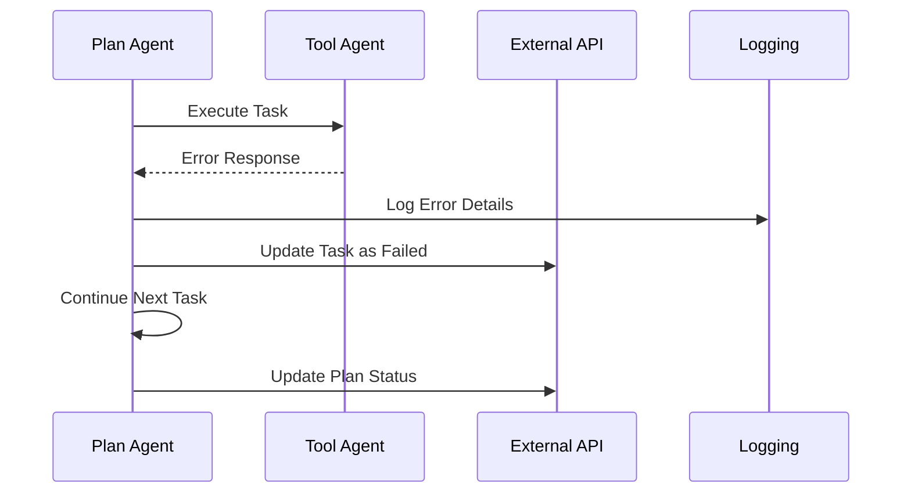

# Plan Agent - Strategic Planning Engine

## 🎯 Tổng quan

**Plan Agent** là strategic planner của hệ thống MAS-Planning, chịu trách nhiệm tạo ra các kế hoạch smart home automation thông minh và thực thi chúng theo cách có tổ chức. Đây là brain của hệ thống khi nói đến việc planning và orchestration.

## 🏗️ Kiến trúc và Workflow



## 🎯 Core Responsibilities

### **1. Strategic Planning**

- **Multi-Priority Planning**: Tạo 3 loại plan (Security, Convenience, Energy)
- **Context-Aware Generation**: Xem xét available MCP tools và device capabilities
- **User-Centric Design**: Tailored plans based on user requirements
- **Scalable Architecture**: Support cho complex multi-room scenarios

### **2. Plan Execution Orchestration**

- **Multi-Agent Coordination**: Integrate với Meta Agent và Tool Agent
- **Workflow Management**: Control execution flow và dependencies
- **Error Handling**: Graceful recovery từ execution failures
- **Progress Tracking**: Real-time monitoring của plan execution

### **3. API Integration**

- **Plan Persistence**: Upload plans to external API systems
- **Status Synchronization**: Real-time status updates
- **Task Management**: Individual task tracking và reporting
- **Completion Reporting**: Comprehensive execution summaries

## 🧩 Core Components

### **1. Router System**

```python
def router(self, state: PlanState):
    """Intelligent routing based on input analysis"""
    selected_plan_id = state.get('selected_plan_id')
    if selected_plan_id:
        return {**state, 'plan_type': 'execute'}
    
    # Check if message indicates plan selection
    input_msg = state.get('input', '').strip().lower()
    if input_msg in ['plan 1', 'plan 2', 'plan 3', '1', '2', '3']:
        # Extract plan number và route to execution
        plan_id = self.extract_plan_number(input_msg)
        return {**state, 'plan_type': 'execute', 'selected_plan_id': plan_id}
    
    # Default to priority planning
    return {**state, 'plan_type': 'priority'}
```

**Routing Logic:**

- **New Planning**: Khi user request planning mới
- **Plan Selection**: Khi user chọn từ existing options
- **Plan Execution**: Khi có selected_plan_id
- **Context Detection**: Smart routing based on conversation context

### **2. Priority Plan Generator**

```python
def priority_plan(self, state: PlanState):
    """Generate 3 priority-based plans"""
    # Get available MCP tools
    available_tools = []
    if self.tools:
        available_tools = [f"- {tool.name}: {tool.description}" for tool in self.tools]
    
    tools_info = "\n".join(available_tools)
    
    # Use structured prompt với MCP tools information
    system_prompt = PLAN_PROMPTS.replace("<<Tools_info>>", tools_info)
    
    messages = convert_messages_list([
        SystemMessage(system_prompt),
        HumanMessage(f"User request: {state.get('input')}")
    ])
    
    # LLM generation
    llm_response = self.llm.invoke(messages)
    plan_data = extract_priority_plans(llm_response.content)
    
    return {
        **state, 
        'plan_options': {
            'security_plan': plan_data.get('Security_Plan', []),
            'convenience_plan': plan_data.get('Convenience_Plan', []),
            'energy_plan': plan_data.get('Energy_Plan', [])
        }, 
        'needs_user_selection': True
    }
```

**Plan Categories:**

- **Security Plan**: Focus trên home security và protection
- **Convenience Plan**: Emphasize user comfort và ease of use  
- **Energy Plan**: Optimize cho energy efficiency và sustainability

### **3. Plan Execution Engine**

```python
def execute_selected_plan(self, state: PlanState):
    """Execute selected plan với full workflow"""
    selected_plan_id = state.get('selected_plan_id')
    plan_options = state.get('plan_options', {})
    
    # Select appropriate plan
    if selected_plan_id == 1:
        selected_plan = plan_options['security_plan']
        plan_type = 'Security Priority Plan'
    elif selected_plan_id == 2:
        selected_plan = plan_options['convenience_plan']
        plan_type = 'Convenience Priority Plan'
    elif selected_plan_id == 3:
        selected_plan = plan_options['energy_plan']
        plan_type = 'Energy Efficiency Priority Plan'
    
    # Initialize sub-agents
    self.init_sub_agents()
    
    # Execute plan through MetaAgent + ToolAgent workflow
    execution_results = []
    for i, task in enumerate(selected_plan, 1):
        # MetaAgent analysis
        meta_result = self.meta_agent.invoke({
            "input": task,
            "context": f"Task {i} of {len(selected_plan)} from {plan_type}",
            "previous_results": execution_results[-3:]
        })
        
        # ToolAgent execution
        tool_result = self.tool_agent.invoke({
            "input": task, 
            "token": state.get('token', '')
        })
        
        # Collect results
        execution_results.append({
            "task_number": i,
            "task": task,
            "meta_analysis": meta_result.get('output', ''),
            "tool_execution": tool_result.get('output', ''),
            "status": "completed" if tool_result.get('tool_agent_result') else "failed"
        })
```

**Execution Features:**

- **Sequential Processing**: Tasks được execute theo order
- **Meta Analysis**: Mỗi task được analyze bởi Meta Agent trước
- **Tool Integration**: Actual execution through Tool Agent
- **Progress Tracking**: Real-time status updates
- **Error Recovery**: Graceful handling của failed tasks

### **4. State Management System**

```python
class PlanState(TypedDict):
    input: str
    plan_status: str
    route: str
    plan: List[str]
    plan_options: Dict[str, List[str]]
    needs_user_selection: bool
    selected_plan_id: Optional[int]
    token: str
    output: str
    execution_results: List[Dict[str, Any]]
```

**State Components:**

- **Input Tracking**: User requests và commands
- **Plan Storage**: Generated plans và options
- **Selection State**: User choice tracking
- **Execution State**: Progress và results
- **Authentication**: Token management cho MCP tools

## 🔄 Workflow Patterns

### **1. New Plan Creation Flow**



### **2. Plan Selection & Execution Flow**



### **3. Error Recovery Flow**



## 🧠 Intelligent Features

### **1. Context-Aware Planning**

```python
def priority_plan(self, state: PlanState):
    """Context-aware plan generation"""
    # Incorporate available MCP tools
    available_tools = self.get_available_tools()
    
    # Consider user environment
    user_context = self.extract_user_context(state.get('input'))
    
    # Generate plans with context
    system_prompt = PLAN_PROMPTS.format(
        tools_info=tools_info,
        user_context=user_context
    )
```

**Context Factors:**

- **Available Tools**: Current MCP tool capabilities
- **Device Status**: Real-time device states
- **User Preferences**: Learned behaviors và settings
- **Environmental Factors**: Time, season, occupancy

### **2. Adaptive Task Sequencing**

```python
def optimize_task_sequence(self, tasks: List[str]) -> List[str]:
    """Optimize task execution order"""
    # Dependency analysis
    dependencies = self.analyze_task_dependencies(tasks)
    
    # Priority scoring
    priorities = self.calculate_task_priorities(tasks)
    
    # Resource optimization
    optimized_sequence = self.optimize_for_resources(tasks, dependencies, priorities)
    
    return optimized_sequence
```

**Optimization Criteria:**

- **Dependency Resolution**: Prerequisites được execute trước
- **Resource Efficiency**: Minimize conflicts và maximize parallelism
- **User Impact**: Prioritize high-impact tasks
- **Error Resilience**: Robust sequencing cho error recovery

### **3. Dynamic Plan Adjustment**

```python
def adjust_plan_execution(self, execution_state: Dict) -> Dict:
    """Dynamically adjust plan based on execution results"""
    completed_tasks = execution_state.get('completed', [])
    failed_tasks = execution_state.get('failed', [])
    remaining_tasks = execution_state.get('pending', [])
    
    # Re-evaluate remaining tasks
    adjusted_tasks = self.re_evaluate_tasks(remaining_tasks, failed_tasks)
    
    # Alternative task suggestions
    alternatives = self.suggest_alternatives(failed_tasks)
    
    return {
        'adjusted_tasks': adjusted_tasks,
        'alternatives': alternatives,
        'recommendations': self.generate_recommendations(execution_state)
    }
```

## 🔧 Technical Implementation

### **1. LangGraph StateGraph Integration**

```python
def create_graph(self):
    """Create execution graph for Plan Agent"""
    graph = StateGraph(PlanState)
    
    # Add nodes
    graph.add_node('route', self.router)
    graph.add_node('priority', self.priority_plan)
    graph.add_node('execute_selected', self.execute_selected_plan)
    graph.add_node('wait_selection', lambda state: {
        **state, 
        'output': 'waiting_for_selection'
    })
    
    # Define edges và conditional routing
    graph.add_edge(START, 'route')
    graph.add_conditional_edges('route', self.route_controller)
    graph.add_conditional_edges('priority', lambda state: 
        'wait_selection' if state.get('needs_user_selection') else 'execute')
    
    return graph.compile(debug=False)
```

### **2. Async MCP Integration**

```python
async def init_async(self):
    """Initialize async components"""
    self.tools = await self.get_mcp_tools()
    self.llm = ChatVertexAI(
        model_name=self.model,
        temperature=self.temperature,
        model_kwargs={"tools": self.tools},
        project=env.GOOGLE_CLOUD_PROJECT,
        location=env.GOOGLE_CLOUD_LOCATION
    )

async def get_mcp_tools(self):
    """Get tools from MCP server"""
    async with MultiServerMCPClient({
        "mcp-server": {
            "url": env.MCP_SERVER_URL,
            "transport": "sse",
        }
    }) as client:
        tools = list(client.get_tools())
        return tools
```

### **3. Sub-Agent Integration**

```python
def init_sub_agents(self):
    """Initialize MetaAgent và ToolAgent when needed"""
    if self.meta_agent is None:
        self.meta_agent = MetaAgent(
            model=self.model,
            temperature=self.temperature,
            verbose=self.verbose
        )
    
    if self.tool_agent is None:
        self.tool_agent = ToolAgent(
            model=self.model,
            temperature=self.temperature,
            verbose=self.verbose
        )
        
        # Async initialization với proper event loop handling
        self.initialize_tool_agent_async()
```

## 📊 Performance Features

### **1. Caching Strategy**

- **Plan Options Cache**: In-memory storage cho quick selections
- **Tool Cache**: MCP tools caching để avoid repeated fetches
- **LLM Response Cache**: Cache cho similar planning requests
- **Session State**: Persistent state across user interactions

### **2. Resource Optimization**

- **Lazy Loading**: Sub-agents chỉ load khi cần
- **Memory Management**: Efficient state cleanup
- **Connection Pooling**: Reuse MCP connections
- **Parallel Processing**: Concurrent task analysis where possible

### **3. Scalability Design**

- **Stateless Core**: Scalable across multiple instances
- **Event-Driven**: Reactive architecture
- **Microservice Ready**: Easy containerization và deployment
- **Load Balancing**: Distribute requests efficiently

## 🔒 Security Features

### **1. Token-Based Authentication**

```python
def execute_selected_plan(self, state: PlanState):
    """Execute với secure token handling"""
    token = state.get('token', '')
    
    # Pass token to Tool Agent securely
    if token:
        tool_result = self.tool_agent.invoke({
            "input": task, 
            "token": token
        })
    else:
        # Handle missing authentication gracefully
        tool_result = self.handle_missing_auth(task)
```

### **2. Input Validation**

- **Plan Validation**: Ensure generated plans are safe
- **Task Sanitization**: Clean task descriptions
- **Device Safety**: Prevent harmful device commands
- **Access Control**: Role-based plan execution permissions

### **3. Error Security**

- **Sanitized Logs**: No sensitive data trong error messages
- **Secure Fallbacks**: Safe defaults when operations fail
- **Audit Trail**: Comprehensive execution logging
- **Privacy Protection**: User data anonymization

## 📈 Monitoring và Analytics

### **1. Execution Metrics**

```python
def execute_selected_plan(self, state: PlanState):
    """Execution với comprehensive metrics"""
    start_time = time.time()
    
    # Track execution progress
    for i, task in enumerate(selected_plan, 1):
        task_start = time.time()
        
        # Execute task
        result = self.execute_task(task)
        
        task_duration = time.time() - task_start
        
        # Log metrics
        self.log_task_metrics(task, task_duration, result)
    
    total_duration = time.time() - start_time
    self.log_plan_metrics(selected_plan, total_duration, execution_results)
```

### **2. Success Rate Tracking**

- **Plan Success Rates**: Track completion rates by plan type
- **Task Success Patterns**: Identify commonly failing tasks
- **Tool Performance**: Monitor MCP tool reliability
- **User Satisfaction**: Implicit feedback từ user behavior

### **3. Performance Analytics**

- **Response Times**: End-to-end planning performance
- **Resource Usage**: Memory và CPU utilization
- **Cache Hit Rates**: Effectiveness của caching strategies
- **Scalability Metrics**: Performance under load

## 🚀 Advanced Capabilities

### **1. Learning và Adaptation**

- **Pattern Recognition**: Learn từ successful plan patterns
- **User Preference Learning**: Adapt to individual user styles
- **Optimization Learning**: Improve task sequencing over time
- **Failure Analysis**: Learn từ execution failures

### **2. Multi-Modal Planning**

- **Voice Integration**: Voice-activated plan creation
- **Visual Planning**: Image-based room analysis
- **Sensor Integration**: Environmental data-driven planning
- **Predictive Planning**: Anticipate user needs

### **3. Extensibility Framework**

- **Custom Plan Types**: Support cho specialized planning modes
- **Plugin Architecture**: Easy integration của new capabilities
- **Template System**: Reusable plan templates
- **API Extensions**: Custom external integrations

---

*Plan Agent là strategic heart của MAS-Planning system, biến user intentions thành actionable smart home automation plans. Với sophisticated planning algorithms và robust execution framework, nó đảm bảo users có experience seamless và effective.*