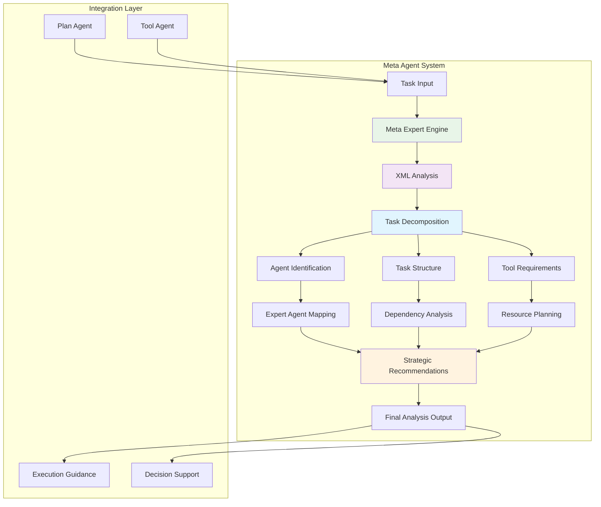
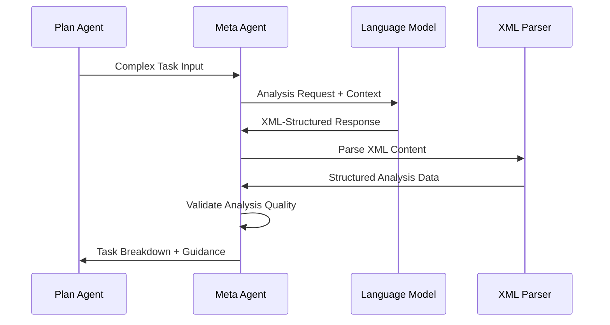
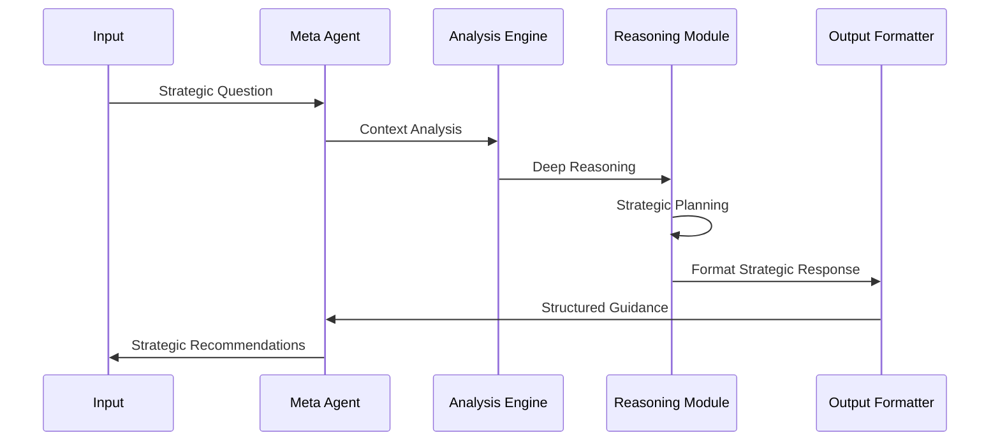
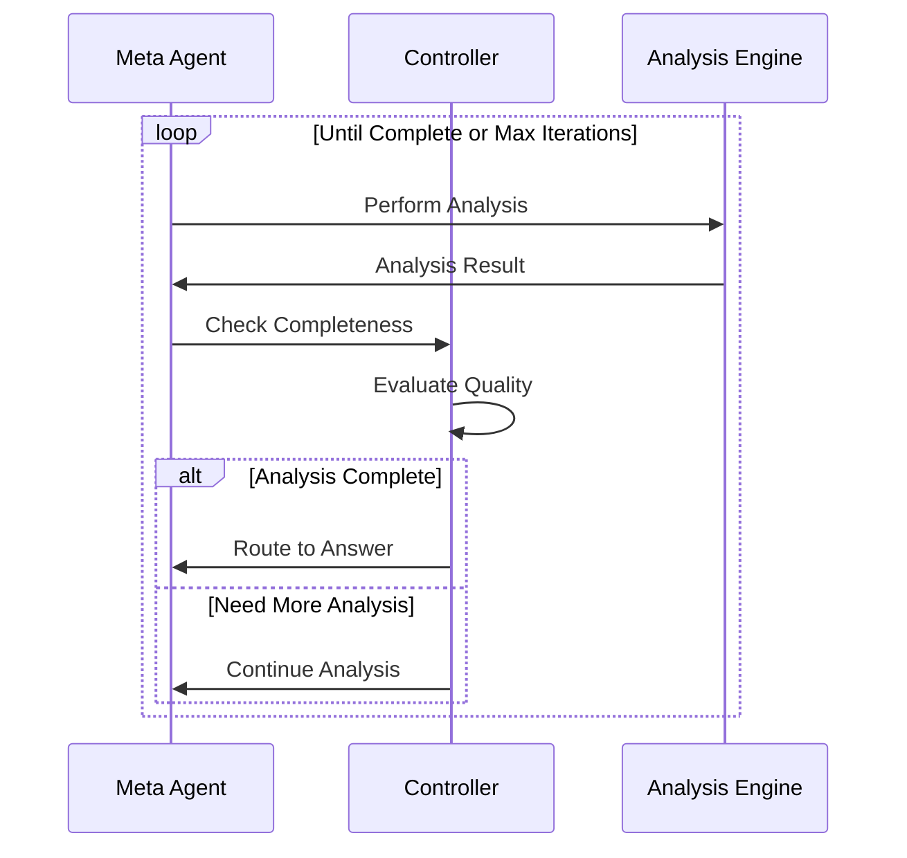

# Meta Agent - Analytical Intelligence Engine

## 🎯 Tổng quan

**Meta Agent** là analytical brain của hệ thống MAS-Planning, chuyên về task analysis, reasoning, và strategic thinking. Nó đóng vai trò như một senior consultant, phân tích sâu các tasks phức tạp và cung cấp insights để guide execution process.

## 🏗️ Kiến trúc và Positioning



## 🎯 Core Responsibilities

### **1. Task Analysis & Decomposition**

- **Complex Task Breakdown**: Phân tích tasks phức tạp thành sub-components
- **Dependency Mapping**: Identify relationships giữa các task elements
- **Context Understanding**: Deep comprehension của task context và implications
- **Strategic Planning**: Provide strategic guidance cho task execution

### **2. Expert Agent Identification**

- **Agent Capability Mapping**: Determine best agent cho specific tasks
- **Resource Requirements**: Analyze tools và resources needed
- **Skill Matching**: Match task requirements với agent capabilities
- **Workflow Optimization**: Suggest optimal execution pathways

### **3. Intelligent Reasoning**

- **Strategic Analysis**: High-level strategic thinking về tasks
- **Problem Solving**: Creative solutions cho complex challenges
- **Risk Assessment**: Identify potential issues và mitigation strategies
- **Quality Assurance**: Ensure task execution quality

## 🧠 Core Architecture

### **1. Meta Expert Engine**

```python
def meta_expert(self, state: AgentState):
    """Core reasoning engine"""
    # Build context từ conversation history và current state
    messages = convert_messages_list(state['messages'])
    
    # LLM analysis với advanced prompting
    llm_response = self.llm.invoke(messages)
    
    # Extract structured data từ XML response
    agent_data = extract_from_xml(llm_response.content)
    
    # Process analysis results
    name = agent_data.get('Agent Name')
    description = agent_data.get('Agent Description')
    tasks = agent_data.get('Tasks')
    tool = agent_data.get('Tool')
    answer = agent_data.get('Answer')
    
    return {
        **state,
        'agent_data': agent_data,
        'messages': [HumanMessage(self.format_response(agent_data))]
    }
```

**Analysis Components:**

- **Agent Identification**: Determine most suitable agent type
- **Task Structure**: Break down complex tasks
- **Tool Requirements**: Specify required tools và resources
- **Strategic Guidance**: Provide high-level direction

### **2. XML Processing System**

```python
def extract_from_xml(text: str) -> Dict[str, Any]:
    """Extract structured data từ XML-formatted LLM responses"""
    import re
    
    # Define extraction patterns
    patterns = {
        'Agent Name': r'<agent_name>(.*?)</agent_name>',
        'Agent Description': r'<agent_description>(.*?)</agent_description>',
        'Tasks': r'<tasks>(.*?)</tasks>',
        'Tool': r'<tool>(.*?)</tool>',
        'Answer': r'<answer>(.*?)</answer>'
    }
    
    extracted_data = {}
    for key, pattern in patterns.items():
        match = re.search(pattern, text, re.DOTALL | re.IGNORECASE)
        if match:
            content = match.group(1).strip()
            # Process lists nếu applicable
            if key == 'Tasks' và '\n' in content:
                extracted_data[key] = [task.strip('- ').strip() 
                                     for task in content.split('\n') 
                                     if task.strip()]
            else:
                extracted_data[key] = content
    
    return extracted_data
```

**XML Structure Benefits:**

- **Structured Output**: Predictable data format
- **Error Handling**: Robust parsing với fallbacks
- **Extensibility**: Easy to add new data fields
- **Validation**: Schema validation support

### **3. Intelligent Routing Logic**

```python
def controller(self, state: AgentState):
    """Control workflow routing based on analysis quality"""
    if self.max_iteration > self.iteration:
        self.iteration += 1
        agent_data = state.get('agent_data')
        
        if agent_data and agent_data.get('Answer'):
            # Complete analysis available
            return 'Answer'
        elif agent_data and self.is_analysis_sufficient(agent_data):
            # Sufficient analysis for next step
            return 'Answer' 
        else:
            # Need more analysis
            return 'Meta'  # Continue analysis
    else:
        # Iteration limit reached
        return 'Answer'

def is_analysis_sufficient(self, agent_data: Dict) -> bool:
    """Determine if analysis is sufficient for execution"""
    required_fields = ['Agent Name', 'Tasks', 'Tool']
    return all(agent_data.get(field) for field in required_fields)
```

## 🔄 Analysis Workflows

### **1. Task Decomposition Flow**



### **2. Strategic Analysis Flow**



### **3. Multi-Iteration Refinement**



## 🧩 Advanced Features

### **1. Context-Aware Analysis**

```python
def invoke(self, input_data) -> dict:
    """Context-aware analysis với multiple input formats"""
    # Handle different input formats
    if isinstance(input_data, dict):
        task = input_data.get('task', '')
        context = input_data.get('context', '')
        previous_results = input_data.get('previous_results', [])
        
        input_text = f"Task: {task}\nContext: {context}"
        if previous_results:
            input_text += f"\nPrevious Results: {previous_results}"
    else:
        input_text = str(input_data)
    
    # Build comprehensive context
    state = {
        'input': input_text,
        'messages': [
            SystemMessage(self.system_prompt),
            HumanMessage(f'User Query: {input_text}')
        ],
        'output': '',
    }
```

**Context Elements:**

- **Task Description**: Primary task to analyze
- **Environmental Context**: Surrounding conditions và constraints
- **Historical Data**: Previous execution results
- **User Preferences**: Learned patterns và preferences

### **2. Multi-Modal Reasoning**

```python
class MetaAgent(BaseAgent):
    """Advanced meta-reasoning capabilities"""
    
    def __init__(self, 
                 tools: list = [], 
                 model: str = "gemini-2.5-pro",
                 temperature: float = 0.2,
                 max_iteration: int = 10,
                 json_mode: bool = False,
                 verbose: bool = False,
                 llm=None):
        
        # Reasoning modes
        self.reasoning_modes = {
            'analytical': self.analytical_reasoning,
            'creative': self.creative_reasoning,
            'strategic': self.strategic_reasoning,
            'tactical': self.tactical_reasoning
        }
```

**Reasoning Modes:**

- **Analytical**: Data-driven, logical analysis
- **Creative**: Innovative solutions và alternatives
- **Strategic**: Long-term planning và optimization
- **Tactical**: Immediate execution guidance

### **3. Dynamic Prompting System**

```python
META_PROMPT = """
You are a Meta-Analysis Expert trong smart home automation system.

CORE COMPETENCIES:
1. Task Analysis & Decomposition
2. Strategic Planning & Reasoning  
3. Agent Capability Assessment
4. Resource Optimization
5. Risk Assessment & Mitigation

ANALYSIS FRAMEWORK:
- Break down complex tasks into manageable components
- Identify dependencies và execution order
- Recommend appropriate tools và agents
- Provide strategic guidance và alternatives

OUTPUT FORMAT:
Always respond in structured XML format:

<agent_name>
[Best agent cho this task]
</agent_name>

<agent_description>
[Why this agent is optimal]
</agent_description>

<tasks>
[Detailed task breakdown]
- Task 1: Description
- Task 2: Description
</tasks>

<tool>
[Required tools và resources]
</tool>

<answer>
[Strategic guidance và recommendations]
</answer>

Focus on actionable insights và practical execution guidance.
"""
```

## 🔧 Technical Implementation

### **1. LangGraph Integration**

```python
def create_graph(self):
    """Create analysis workflow graph"""
    graph = StateGraph(AgentState)
    
    # Core analysis node
    graph.add_node('Meta', self.meta_expert)
    
    # Final answer processing
    graph.add_node('Answer', self.final)
    
    # Entry point
    graph.set_entry_point('Meta')
    
    # Conditional routing cho iterative refinement
    graph.add_conditional_edges('Meta', self.controller)
    
    # Terminal node
    graph.add_edge('Answer', END)
    
    return graph.compile(debug=False)
```

### **2. State Management**

```python
class AgentState(TypedDict):
    input: str
    messages: List[Message]
    agent_data: Dict[str, Any]
    output: str
    iteration_count: int
    analysis_quality: float
    confidence_score: float
```

**State Components:**

- **Input Processing**: Raw input và formatted queries
- **Message History**: Conversation context và analysis chain
- **Analysis Data**: Structured results từ XML parsing
- **Quality Metrics**: Analysis confidence và completeness scores

### **3. Error Handling & Recovery**

```python
def robust_xml_extraction(self, text: str) -> Dict[str, Any]:
    """Robust XML extraction với multiple fallback strategies"""
    try:
        # Primary XML extraction
        return self.extract_from_xml(text)
    except XMLParseError:
        # Fallback to regex patterns
        return self.regex_fallback_extraction(text)
    except Exception as e:
        # Final fallback to keyword extraction
        logger.warning(f"XML extraction failed: {e}")
        return self.keyword_fallback_extraction(text)

def fallback_response_generation(self, input_text: str) -> Dict[str, Any]:
    """Generate fallback response when analysis fails"""
    return {
        'Agent Name': 'General Assistant',
        'Agent Description': 'Fallback analysis due to processing error',
        'Tasks': [f'Process request: {input_text[:100]}...'],
        'Tool': 'Standard tools',
        'Answer': 'Analysis completed with fallback method'
    }
```

## 📊 Performance Optimizations

### **1. Caching Strategy**

- **Analysis Cache**: Cache similar task analyses
- **Pattern Recognition**: Reuse analysis patterns
- **Context Compression**: Efficient context storage
- **LLM Response Cache**: Cache structured responses

### **2. Iteration Optimization**

```python
def optimize_iteration_strategy(self, state: AgentState) -> str:
    """Optimize số lượng iterations needed"""
    analysis_quality = self.assess_analysis_quality(state)
    
    if analysis_quality > 0.9:
        # High quality, complete early
        return 'Answer'
    elif analysis_quality > 0.7 and self.iteration > 2:
        # Good enough quality after some iterations
        return 'Answer'
    elif self.iteration >= self.max_iteration:
        # Prevent infinite loops
        return 'Answer'
    else:
        # Continue analysis
        return 'Meta'
```

### **3. Resource Management**

- **Memory Optimization**: Efficient state management
- **CPU Utilization**: Optimized parsing algorithms
- **LLM Call Optimization**: Minimize unnecessary API calls
- **Response Size Management**: Control output verbosity

## 🔒 Security Features

### **1. Input Sanitization**

```python
def sanitize_input(self, input_text: str) -> str:
    """Sanitize input to prevent injection attacks"""
    # Remove potentially harmful content
    sanitized = self.remove_script_tags(input_text)
    sanitized = self.escape_special_characters(sanitized)
    sanitized = self.limit_input_length(sanitized)
    
    return sanitized
```

### **2. Output Validation**

- **Schema Validation**: Ensure output conforms to expected structure
- **Content Filtering**: Filter potentially harmful recommendations
- **Privilege Checking**: Validate recommended actions against permissions
- **Audit Logging**: Comprehensive logging của analysis decisions

### **3. Safe Analysis Practices**

- **Sandboxed Execution**: Isolated analysis environment
- **Rate Limiting**: Prevent analysis abuse
- **Access Control**: Role-based analysis permissions
- **Data Privacy**: Anonymize sensitive information trong logs

## 📈 Analytics và Monitoring

### **1. Analysis Quality Metrics**

```python
def assess_analysis_quality(self, state: AgentState) -> float:
    """Assess quality của current analysis"""
    agent_data = state.get('agent_data', {})
    
    # Completeness score
    required_fields = ['Agent Name', 'Tasks', 'Tool', 'Answer']
    completeness = sum(1 for field in required_fields 
                      if agent_data.get(field)) / len(required_fields)
    
    # Detail score
    detail_score = self.calculate_detail_score(agent_data)
    
    # Coherence score
    coherence_score = self.calculate_coherence_score(agent_data)
    
    return (completeness + detail_score + coherence_score) / 3
```

### **2. Performance Tracking**

- **Response Time**: Analysis processing duration
- **Accuracy Metrics**: Correctness của agent recommendations
- **User Satisfaction**: Implicit feedback từ subsequent actions
- **Iteration Efficiency**: Optimal iterations per analysis

### **3. Learning Analytics**

- **Pattern Recognition**: Common analysis patterns
- **Success Predictors**: Factors leading to successful analyses
- **Failure Analysis**: Understanding analysis failures
- **Improvement Opportunities**: Areas cho enhancement

## 🚀 Advanced Capabilities

### **1. Domain-Specific Analysis**

```python
def domain_specific_analysis(self, task: str, domain: str) -> Dict:
    """Specialized analysis cho specific domains"""
    domain_handlers = {
        'security': self.security_analysis,
        'energy': self.energy_analysis,
        'convenience': self.convenience_analysis,
        'maintenance': self.maintenance_analysis
    }
    
    handler = domain_handlers.get(domain, self.general_analysis)
    return handler(task)
```

### **2. Predictive Analysis**

- **Outcome Prediction**: Predict task execution outcomes
- **Resource Forecasting**: Estimate resource requirements
- **Risk Assessment**: Identify potential execution risks
- **Success Probability**: Calculate execution success likelihood

### **3. Collaborative Analysis**

- **Multi-Agent Consultation**: Collaborate với other agents
- **Expert System Integration**: Leverage external expertise
- **Crowd-Sourced Insights**: Incorporate community knowledge
- **Continuous Learning**: Adapt based on execution feedback

## 🎯 Integration Patterns

### **1. Plan Agent Integration**

```python
# Plan Agent calls Meta Agent for task analysis
meta_input = {
    "input": task,
    "context": f"This is task {i} of {len(selected_plan)} from {plan_type}",
    "previous_results": execution_results[-3:]
}

meta_result = self.meta_agent.invoke(meta_input)
```

### **2. Tool Agent Collaboration**

- **Tool Recommendation**: Suggest optimal tools cho tasks
- **Execution Guidance**: Provide tactical execution advice
- **Error Recovery**: Assist trong troubleshooting failures
- **Performance Optimization**: Optimize tool usage patterns

### **3. Real-Time Advisory**

- **Live Consultation**: Real-time analysis during execution
- **Dynamic Adjustment**: Adjust strategies based on current state
- **Immediate Feedback**: Provide instant recommendations
- **Continuous Monitoring**: Ongoing analysis của execution progress

---

*Meta Agent represents the analytical intelligence của MAS-Planning system, ensuring mọi task được approached với strategic thinking và deep understanding. Nó là bridge giữa high-level planning và concrete execution, providing the wisdom needed cho successful smart home automation.*