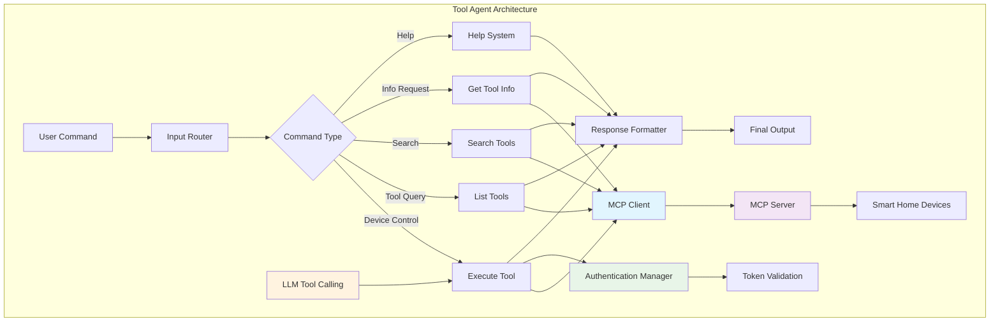
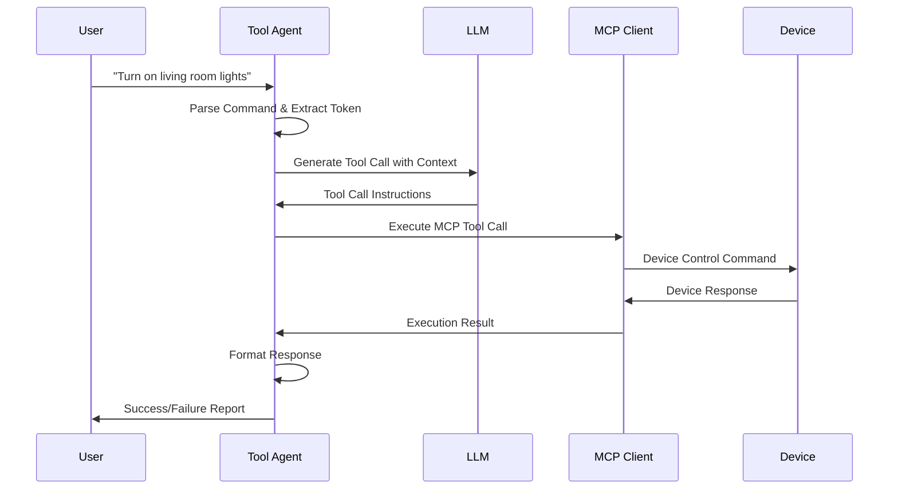
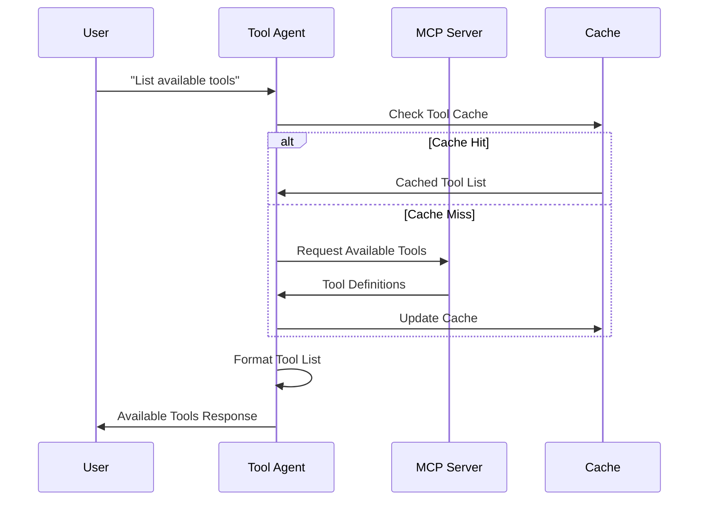
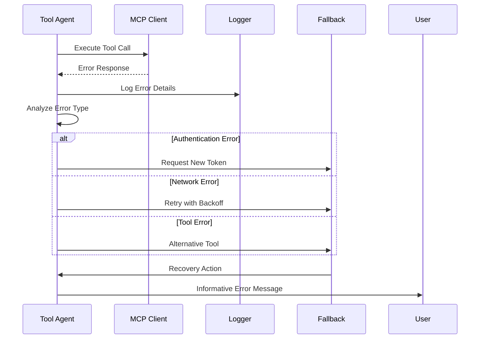

# Tool Agent - Execution Engine

## 🎯 Tổng quan

**Tool Agent** là execution powerhouse của hệ thống MAS-Planning, chịu trách nhiệm thực thi concrete actions thông qua Model Context Protocol (MCP) tools. Đây là "hands" của hệ thống, biến plans và analyses thành real-world device control actions.

## 🏗️ Kiến trúc và Integration



## 🎯 Core Responsibilities

### **1. Device Control Execution**

- **Real-time Device Control**: Immediate response cho device commands
- **Multi-Device Coordination**: Orchestrate multiple device actions
- **State Management**: Track và maintain device states
- **Error Recovery**: Handle device communication failures gracefully

### **2. MCP Tool Integration**

- **Tool Discovery**: Dynamic discovery của available MCP tools
- **Tool Orchestration**: Intelligent tool selection và execution
- **Protocol Management**: Handle MCP communication protocols
- **Service Integration**: Connect với various smart home services

### **3. Authentication & Security**

- **Token-Based Authentication**: Secure authentication với MCP servers
- **Access Control**: Validate permissions cho device operations
- **Security Validation**: Ensure safe device operations
- **Audit Logging**: Comprehensive security event logging

### **4. Response Processing**

- **Result Formatting**: User-friendly response formatting
- **Error Handling**: Graceful error reporting và recovery
- **Status Reporting**: Real-time operation status updates
- **Performance Monitoring**: Track execution performance

## 🧩 Core Components

### **1. Intelligent Router System**

```python
def router(self, state: ToolState):
    """Route input to appropriate action"""
    input_value = state.get('input', '') or ''
    input_text = input_value.lower() if input_value else ''
    
    # Priority routing logic
    if any(keyword in input_text for keyword in [
        'device', 'room', 'living room', 'bedroom', 'kitchen', 
        'switch', 'control', 'turn on', 'turn off', 'air conditioner'
    ]):
        route = 'execute_tool'
    elif any(keyword in input_text for keyword in [
        'list tools', 'available tools', 'show tools', 'what tools'
    ]) and 'device' not in input_text:
        route = 'list_tools'
    elif any(keyword in input_text for keyword in [
        'search', 'find'
    ]):
        route = 'search_tools'
    elif any(keyword in input_text for keyword in [
        'info', 'detail', 'describe'
    ]):
        route = 'get_tool_info'
    else:
        # Default to execution for device commands
        route = 'execute_tool'
    
    return {**state, 'route': route}
```

**Routing Intelligence:**

- **Context-Aware**: Understanding context từ input patterns
- **Priority-Based**: Device control có highest priority
- **Fallback Logic**: Intelligent defaults cho ambiguous inputs
- **Extensible**: Easy to add new routing rules

### **2. MCP Tool Management**

```python
async def get_mcp_tools(self):
    """Get tools from MCP server với error handling"""
    try:
        async with asyncio.timeout(5):  # 5 second timeout
            async with MultiServerMCPClient({
                "mcp-server": {
                    "url": env.MCP_SERVER_URL,
                    "transport": "sse",
                }
            }) as client:
                tools = list(client.get_tools())
                return tools
    except asyncio.TimeoutError:
        logger.error("❌ MCP connection timeout after 5 seconds")
        return []
    except Exception as e:
        logger.error(f"❌ MCP connection failed: {str(e)}")
        return []
```

**Tool Management Features:**

- **Dynamic Discovery**: Real-time tool availability checking
- **Connection Pooling**: Efficient MCP connection management
- **Timeout Handling**: Robust timeout mechanisms
- **Error Recovery**: Graceful handling của connection failures

### **3. Authentication Framework**

```python
def detect_placeholder_tokens(self, text: str) -> List[str]:
    """Detect placeholder tokens in text"""
    patterns = [
        r"token\s*=\s*['\"]your_auth_token['\"]",
        r"token\s*=\s*['\"]your_token['\"]", 
        r"token\s*=\s*['\"]auth_token['\"]",
        r"token\s*=\s*['\"][^'\"]*token[^'\"]*['\"]"
    ]
    
    found_tokens = []
    for pattern in patterns:
        matches = re.findall(pattern, text, re.IGNORECASE)
        found_tokens.extend(matches)
    
    return found_tokens

def replace_placeholder_tokens(self, text: str, real_token: str) -> str:
    """Replace placeholder tokens with real authentication token"""
    if not real_token:
        return text
    
    patterns = [
        (r"token\s*=\s*['\"]your_auth_token['\"]", f"token='{real_token}'"),
        (r"token\s*=\s*['\"]your_token['\"]", f"token='{real_token}'"),
        (r"token\s*=\s*['\"]auth_token['\"]", f"token='{real_token}'"),
    ]
    
    result = text
    for pattern, replacement in patterns:
        result = re.sub(pattern, replacement, result, flags=re.IGNORECASE)
    
    return result
```

**Security Features:**

- **Token Detection**: Intelligent placeholder token identification
- **Secure Replacement**: Safe token substitution
- **No Storage**: Tokens are never persisted
- **Validation**: Token format và validity checking

### **4. Execution Engine**

```python
def execute_tool(self, state: ToolState):
    """Execute tool với comprehensive error handling"""
    query = state.get('input', '')
    token = state.get('token', '')
    
    if not self.llm:
        return {**state, 'output': "❌ LLM not initialized", 'error': 'LLM not initialized'}
    
    if not self.tools:
        return {**state, 'output': "❌ No MCP tools available", 'error': 'No MCP tools'}
    
    try:
        # Process authentication requirements
        placeholder_tokens = self.detect_placeholder_tokens(query)
        processed_query = self.replace_placeholder_tokens(query, token) if token else query
        
        # Build enhanced system prompt với authentication
        system_prompt = TOOL_PROMPT
        if token:
            system_prompt += f"""
🔐 AUTHENTICATION TOKEN PROVIDED:
Your authentication token is: {token}

MANDATORY: Include this exact token in EVERY MCP tool call using the 'token' parameter.
Example tool calls:
- get_device_list(token="{token}")
- switch_device_control(token="{token}", buttonId=123, action="on")

NEVER make tool calls without the token parameter."""
        
        # Invoke LLM với tools
        messages = [SystemMessage(system_prompt), HumanMessage(processed_query)]
        lc_messages = convert_messages_list(messages)
        response = self.llm.invoke(lc_messages)
        
        # Process tool calls
        if hasattr(response, 'tool_calls') and response.tool_calls:
            return self.process_tool_calls(response.tool_calls, state)
        else:
            return {**state, 'output': f"🔧 **Tool Response:**\n\n{response.content}"}
            
    except Exception as e:
        return self.handle_execution_error(e, query, state)
```

## 🔄 Execution Workflows

### **1. Device Control Flow**



### **2. Tool Discovery Flow**



### **3. Error Recovery Flow**



## 🧠 Advanced Features

### **1. Intelligent Tool Selection**

```python
async def call_tool_async(self):
    """Call tool với fresh MCP connection"""
    try:
        # Get token từ state
        token = state.get('token', '')
        if token:
            tool_args['token'] = token
            logger.info(f"🔑 Token injected into tool args")
        
        # Create fresh MCP client connection
        async with MultiServerMCPClient({
            "mcp-server": {
                "url": env.MCP_SERVER_URL,
                "transport": "sse",
            }
        }) as client:
            # Get fresh tools từ client
            fresh_tools = list(client.get_tools())
            
            # Find matching tool trong fresh tools
            fresh_tool = None
            for tool in fresh_tools:
                if tool.name == tool_name:
                    fresh_tool = tool
                    break
            
            if not fresh_tool:
                return f"Tool {tool_name} not found in fresh MCP connection"
            
            # Call the fresh tool
            result = await fresh_tool.ainvoke(tool_args)
            return result
            
    except Exception as e:
        error_msg = f"Tool call failed: {str(e)}"
        logger.error(f"❌ Tool call error: {error_msg}")
        return error_msg
```

**Selection Intelligence:**

- **Dynamic Tool Discovery**: Real-time tool availability
- **Fresh Connection Strategy**: Avoid stale connection issues
- **Capability Matching**: Match tools to task requirements
- **Performance Optimization**: Select fastest/most reliable tools

### **2. Response Processing Engine**

```python
def process_tool_results(self, result) -> str:
    """Process và format tool execution results"""
    if isinstance(result, str):
        # Check for authentication errors
        if any(phrase in result.lower() for phrase in [
            "need a token", "token required", "authenticate", 
            "authorization failed", "invalid token"
        ]):
            return self.format_auth_error(result)
        elif result.startswith("Tool call failed:"):
            return f"**Error**: {result}"
        else:
            # Try to parse as JSON for better formatting
            try:
                import json
                parsed = json.loads(result)
                return self.format_json_response(parsed)
            except (json.JSONDecodeError, TypeError):
                return result
    elif isinstance(result, dict):
        return self.format_dict_response(result)
    else:
        return str(result)

def format_device_list(self, devices: List[Dict]) -> str:
    """Format device list for user-friendly display"""
    devices_info = []
    for room in devices:
        room_name = room.get('room_name', 'Unknown Room')
        devices = room.get('devices', [])
        buttons = room.get('buttons', [])
        
        devices_info.append(f"🏠 **{room_name}**:")
        for device in devices:
            status = device.get('device_status', 'Unknown')
            devices_info.append(f"  📱 {device.get('name', 'Unknown Device')} ({status})")
        for button in buttons:
            status = button.get('status', 'Unknown')
            type_info = button.get('button_type', 'Unknown Type')
            devices_info.append(f"  🔘 {button.get('name', 'Unknown Button')} ({type_info}) - {status}")
    
    return "\n".join(devices_info)
```

### **3. Error Handling Framework**

```python
def handle_execution_error(self, error: Exception, query: str, state: ToolState) -> Dict:
    """Comprehensive error handling với user-friendly responses"""
    error_msg = str(error)
    
    # Categorize error types
    if "authentication" in error_msg.lower():
        output = self.format_auth_error_response(error_msg)
    elif "network" in error_msg.lower() or "connection" in error_msg.lower():
        output = self.format_network_error_response(error_msg)
    elif "timeout" in error_msg.lower():
        output = self.format_timeout_error_response(error_msg)
    else:
        # Fallback to mock execution for development
        output = f"""🧪 **Mock Tool Execution** (Error encountered):

Task: {query}
Status: ⚠️ Simulated execution (Error: {error_msg})
Result: Mock response for development purposes
Note: The actual tool execution failed, but this demonstrates the expected response format."""
    
    return {**state, 'output': output, 'error': error_msg}

def format_auth_error_response(self, error_msg: str) -> str:
    """Format authentication error messages"""
    return f"""🔐 **Authentication Required**

The MCP tool requires a valid authentication token. Please ensure you have provided a current OXII API token.

Error Details: {error_msg}

💡 **How to Fix:**
1. Obtain a fresh token from the OXII system
2. Include the token in your request
3. Ensure the token has not expired

Example: {{"input": "turn on lights", "token": "your_valid_token_here"}}"""
```

## 🔧 Technical Implementation

### **1. Async Architecture**

```python
async def init_async(self):
    """Initialize async components"""
    self.tools = await self.get_mcp_tools()
    base_llm = ChatVertexAI(
        model_name=self.model,
        temperature=self.temperature,
        project=env.GOOGLE_CLOUD_PROJECT,
        location=env.GOOGLE_CLOUD_LOCATION
    )
    
    # Bind tools to LLM for proper tool calling
    if self.tools:
        self.llm = base_llm.bind_tools(self.tools)
    else:
        self.llm = base_llm
    
    if self.verbose:
        logger.info(f"🔧 Loaded {len(self.tools)} MCP tools")
```

### **2. LangGraph State Management**

```python
class ToolState(TypedDict):
    input: str
    token: str
    route: str
    output: str
    tool_data: Dict[str, Any]
    error: str

def create_graph(self):
    """Create execution graph for ToolAgent"""
    workflow = StateGraph(ToolState)
    
    # Add nodes
    workflow.add_node('router', self.router)
    workflow.add_node('list_tools', self.list_tools)
    workflow.add_node('search_tools', self.search_tools)
    workflow.add_node('get_tool_info', self.get_tool_info)
    workflow.add_node('execute_tool', self.execute_tool)
    workflow.add_node('help_with_tool', self.help_with_tool)
    
    # Set entry point
    workflow.set_entry_point('router')
    
    # Add conditional edges
    workflow.add_conditional_edges('router', self.controller)
    
    # All nodes terminate
    for node in ['list_tools', 'search_tools', 'get_tool_info', 'execute_tool', 'help_with_tool']:
        workflow.add_edge(node, END)
    
    return workflow.compile(debug=self.verbose)
```

### **3. Event Loop Management**

```python
def run_async_tool(self):
    """Run async tool trong proper event loop"""
    try:
        # Check if we're already in an event loop
        try:
            loop = asyncio.get_running_loop()
            logger.info("🔄 Using existing event loop")
            # Create a new task trong existing loop
            import concurrent.futures
            with concurrent.futures.ThreadPoolExecutor() as executor:
                future = executor.submit(asyncio.run, self.call_tool_async())
                return future.result(timeout=30)
        except RuntimeError:
            # No running loop, create a new one
            logger.info("🆕 Creating new event loop")
            return asyncio.run(self.call_tool_async())
    except Exception as e:
        error_msg = f"Async execution failed: {str(e)}"
        logger.error(f"❌ Async execution error: {error_msg}")
        return error_msg
```

## 📊 Performance Features

### **1. Connection Management**

- **Connection Pooling**: Reuse MCP connections efficiently
- **Timeout Management**: Prevent hanging connections
- **Retry Logic**: Intelligent retry strategies
- **Resource Cleanup**: Proper connection disposal

### **2. Caching Strategy**

- **Tool Cache**: Cache available tools to reduce discovery overhead
- **Response Cache**: Cache common tool responses
- **Authentication Cache**: Temporary token validation caching
- **Error Cache**: Cache error patterns for faster recovery

### **3. Resource Optimization**

- **Memory Management**: Efficient state handling
- **CPU Optimization**: Optimize parsing và processing
- **Network Efficiency**: Minimize redundant network calls
- **Async Processing**: Non-blocking execution patterns

## 🔒 Security Implementation

### **1. Token Security**

```python
def secure_token_handling(self, token: str, tool_args: Dict) -> Dict:
    """Secure token injection into tool arguments"""
    if not token:
        logger.warning("⚠️ No token provided for secure operation")
        return tool_args
    
    # Validate token format
    if not self.validate_token_format(token):
        logger.error("❌ Invalid token format")
        raise ValueError("Invalid authentication token format")
    
    # Inject token securely
    secured_args = tool_args.copy()
    secured_args['token'] = token
    
    # Log access (without exposing token)
    logger.info(f"🔑 Token injected for tool operation: {token[:10]}...")
    
    return secured_args
```

### **2. Input Validation**

- **Command Sanitization**: Clean input commands
- **Injection Prevention**: Prevent command injection attacks
- **Parameter Validation**: Validate tool parameters
- **Access Control**: Verify operation permissions

### **3. Audit & Compliance**

- **Operation Logging**: Log all tool executions
- **Access Tracking**: Track device access patterns
- **Security Events**: Monitor security-related events
- **Compliance Reporting**: Generate compliance reports

## 📈 Monitoring & Analytics

### **1. Performance Metrics**

```python
def track_execution_metrics(self, tool_name: str, duration: float, success: bool):
    """Track tool execution performance"""
    metrics = {
        'tool_name': tool_name,
        'execution_time': duration,
        'success': success,
        'timestamp': time.time(),
        'session_id': self.session_id
    }
    
    # Log to monitoring system
    self.metrics_logger.info(json.dumps(metrics))
    
    # Update running statistics
    self.update_performance_stats(tool_name, duration, success)
```

### **2. Health Monitoring**

- **Tool Availability**: Monitor MCP tool health
- **Response Times**: Track execution performance
- **Error Rates**: Monitor failure patterns
- **Resource Usage**: Track system resource consumption

### **3. Usage Analytics**

- **Tool Usage Patterns**: Analyze tool usage frequency
- **User Behavior**: Understand user interaction patterns
- **Success Rates**: Track operation success rates
- **Optimization Opportunities**: Identify improvement areas

## 🚀 Advanced Capabilities

### **1. Multi-Device Coordination**

```python
def coordinate_multi_device_operation(self, devices: List[str], action: str) -> Dict:
    """Coordinate operations across multiple devices"""
    results = []
    
    # Execute operations trong parallel where safe
    for device in devices:
        if self.is_safe_parallel_operation(device, action):
            result = self.execute_parallel(device, action)
        else:
            result = self.execute_sequential(device, action)
        
        results.append({
            'device': device,
            'action': action,
            'result': result,
            'timestamp': time.time()
        })
    
    return {
        'operation': 'multi_device_coordination',
        'total_devices': len(devices),
        'successful': len([r for r in results if r['result']['success']]),
        'results': results
    }
```

### **2. Predictive Execution**

- **Usage Pattern Learning**: Learn từ user behavior
- **Predictive Caching**: Pre-load likely-needed tools
- **Smart Defaults**: Intelligent parameter defaults
- **Context Awareness**: Adapt to environmental context

### **3. Integration Ecosystem**

- **Plugin Architecture**: Support for custom tools
- **API Extensions**: External service integration
- **Webhook Support**: Event-driven integrations
- **Third-Party Services**: Connect với external platforms

---

*Tool Agent is the execution powerhouse của MAS-Planning system, transforming high-level plans và analyses into concrete device control actions. Với robust MCP integration, intelligent error handling, và comprehensive security features, nó ensures reliable và secure smart home automation execution.*