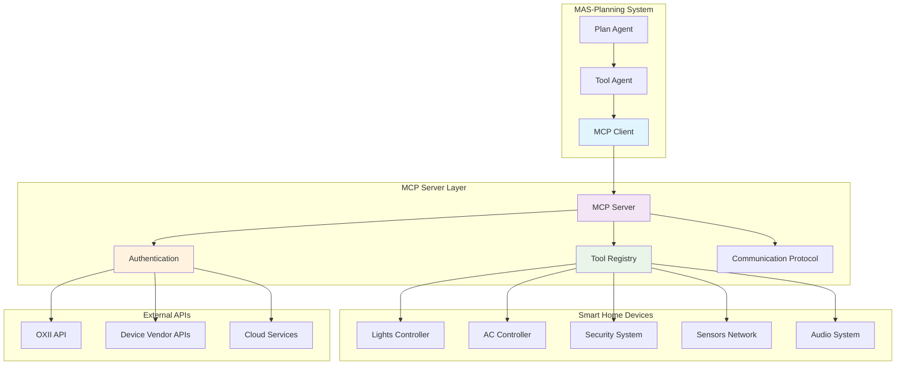

# MCP Integration & External Services

## 🎯 Tổng quan

Hệ thống MAS-Planning tích hợp với nhiều external services và protocols để cung cấp comprehensive smart home automation solution. Document này mô tả chi tiết các integration patterns, security measures, và best practices.

## 🔌 Model Context Protocol (MCP) Integration

### **1. MCP Architecture Overview**



### **2. MCP Client Implementation**

```python
from langchain_mcp_adapters.client import MultiServerMCPClient

class MCPIntegration:
    """MCP Integration Manager"""
    
    def __init__(self):
        self.client_config = {
            "mcp-server": {
                "url": env.MCP_SERVER_URL,
                "transport": "sse",  # Server-Sent Events
            }
        }
        self.tools_cache = {}
        self.connection_pool = {}
    
    async def get_tools(self) -> List[Tool]:
        """Get available tools từ MCP server"""
        try:
            async with asyncio.timeout(5):
                async with MultiServerMCPClient(self.client_config) as client:
                    tools = list(client.get_tools())
                    self.cache_tools(tools)
                    return tools
        except asyncio.TimeoutError:
            logger.error("MCP connection timeout")
            return self.get_cached_tools()
        except Exception as e:
            logger.error(f"MCP connection failed: {e}")
            return []
    
    async def execute_tool(self, tool_name: str, args: Dict, token: str = None) -> Any:
        """Execute MCP tool với authentication"""
        try:
            # Inject authentication token
            if token:
                args['token'] = token
            
            async with MultiServerMCPClient(self.client_config) as client:
                tools = list(client.get_tools())
                
                # Find matching tool
                target_tool = None
                for tool in tools:
                    if tool.name == tool_name:
                        target_tool = tool
                        break
                
                if not target_tool:
                    raise ValueError(f"Tool {tool_name} not found")
                
                # Execute tool
                result = await target_tool.ainvoke(args)
                return result
                
        except Exception as e:
            logger.error(f"Tool execution failed: {e}")
            raise
```

### **3. Tool Discovery & Registration**

```python
class ToolRegistry:
    """Dynamic tool discovery và management"""
    
    def __init__(self):
        self.tools = {}
        self.tool_metadata = {}
        self.capabilities = {}
    
    async def discover_tools(self) -> Dict[str, Tool]:
        """Discover và catalog available tools"""
        discovered_tools = {}
        
        async with MultiServerMCPClient(self.client_config) as client:
            tools = list(client.get_tools())
            
            for tool in tools:
                # Extract tool metadata
                metadata = self.extract_tool_metadata(tool)
                
                # Categorize tool capabilities
                capabilities = self.analyze_tool_capabilities(tool)
                
                # Register tool
                discovered_tools[tool.name] = tool
                self.tool_metadata[tool.name] = metadata
                self.capabilities[tool.name] = capabilities
        
        return discovered_tools
    
    def extract_tool_metadata(self, tool: Tool) -> Dict:
        """Extract comprehensive tool metadata"""
        return {
            'name': getattr(tool, 'name', 'Unknown'),
            'description': getattr(tool, 'description', ''),
            'input_schema': getattr(tool, 'inputSchema', {}),
            'output_schema': getattr(tool, 'outputSchema', {}),
            'parameters': self.extract_parameters(tool),
            'required_auth': self.check_auth_requirements(tool),
            'device_types': self.identify_device_types(tool),
            'capabilities': self.extract_capabilities(tool)
        }
    
    def analyze_tool_capabilities(self, tool: Tool) -> List[str]:
        """Analyze tool capabilities for smart routing"""
        capabilities = []
        
        name = getattr(tool, 'name', '').lower()
        description = getattr(tool, 'description', '').lower()
        
        # Device control capabilities
        if any(keyword in name + description for keyword in [
            'switch', 'control', 'turn', 'toggle'
        ]):
            capabilities.append('device_control')
        
        # Information retrieval
        if any(keyword in name + description for keyword in [
            'get', 'list', 'status', 'info'
        ]):
            capabilities.append('information_retrieval')
        
        # Configuration
        if any(keyword in name + description for keyword in [
            'set', 'config', 'setup', 'configure'
        ]):
            capabilities.append('configuration')
        
        return capabilities
```

### **4. Protocol Communication**

```python
class MCPProtocolManager:
    """Manage MCP protocol communication"""
    
    def __init__(self):
        self.transport_type = "sse"  # Server-Sent Events
        self.connection_timeout = 30
        self.retry_attempts = 3
        self.backoff_factor = 2
    
    async def establish_connection(self) -> MultiServerMCPClient:
        """Establish robust MCP connection"""
        for attempt in range(self.retry_attempts):
            try:
                client = MultiServerMCPClient(self.client_config)
                await client.__aenter__()
                
                # Verify connection health
                await self.verify_connection_health(client)
                
                return client
                
            except Exception as e:
                wait_time = self.backoff_factor ** attempt
                logger.warning(f"Connection attempt {attempt + 1} failed: {e}")
                
                if attempt < self.retry_attempts - 1:
                    await asyncio.sleep(wait_time)
                else:
                    raise ConnectionError(f"Failed to establish MCP connection after {self.retry_attempts} attempts")
    
    async def verify_connection_health(self, client: MultiServerMCPClient):
        """Verify MCP connection health"""
        try:
            # Test basic functionality
            tools = list(client.get_tools())
            if not tools:
                logger.warning("No tools available from MCP server")
            else:
                logger.info(f"MCP connection healthy: {len(tools)} tools available")
        except Exception as e:
            raise ConnectionError(f"MCP connection health check failed: {e}")
```

## 🔐 Authentication & Security

### **1. Token-Based Authentication**

```python
class AuthenticationManager:
    """Manage authentication across services"""
    
    def __init__(self):
        self.token_validators = {}
        self.auth_cache = TTLCache(maxsize=1000, ttl=300)  # 5-minute cache
        self.security_logger = logging.getLogger('security')
    
    def validate_token(self, token: str, service: str = 'default') -> bool:
        """Validate authentication token"""
        if not token:
            return False
        
        # Check cache first
        cache_key = f"{service}:{hash(token)}"
        if cache_key in self.auth_cache:
            return self.auth_cache[cache_key]
        
        # Validate token format
        if not self.validate_token_format(token):
            self.security_logger.warning(f"Invalid token format for {service}")
            return False
        
        # Service-specific validation
        validator = self.token_validators.get(service, self.default_validator)
        is_valid = validator(token)
        
        # Cache result
        self.auth_cache[cache_key] = is_valid
        
        return is_valid
    
    def inject_authentication(self, args: Dict, token: str) -> Dict:
        """Securely inject authentication into tool arguments"""
        if not token:
            raise AuthenticationError("Authentication token required")
        
        # Validate token
        if not self.validate_token(token):
            raise AuthenticationError("Invalid authentication token")
        
        # Create secure copy
        authenticated_args = args.copy()
        authenticated_args['token'] = token
        
        # Log access (without exposing token)
        self.security_logger.info(f"Authentication injected: {token[:8]}...")
        
        return authenticated_args
    
    def validate_token_format(self, token: str) -> bool:
        """Validate token format và structure"""
        if not isinstance(token, str):
            return False
        
        if len(token) < 10:  # Minimum token length
            return False
        
        # Add more validation logic as needed
        return True
```

### **2. Secure Communication**

```python
class SecureCommunication:
    """Secure communication manager"""
    
    def __init__(self):
        self.encryption_enabled = True
        self.verify_ssl = True
        self.timeout = 30
    
    async def secure_request(self, url: str, data: Dict, headers: Dict = None) -> Dict:
        """Make secure HTTP request"""
        import aiohttp
        import ssl
        
        # Configure SSL context
        ssl_context = ssl.create_default_context()
        if not self.verify_ssl:
            ssl_context.check_hostname = False
            ssl_context.verify_mode = ssl.CERT_NONE
        
        # Default headers
        default_headers = {
            'Content-Type': 'application/json',
            'User-Agent': 'MAS-Planning-System/1.0'
        }
        
        if headers:
            default_headers.update(headers)
        
        try:
            async with aiohttp.ClientSession(
                timeout=aiohttp.ClientTimeout(total=self.timeout),
                connector=aiohttp.TCPConnector(ssl=ssl_context)
            ) as session:
                async with session.post(url, json=data, headers=default_headers) as response:
                    response.raise_for_status()
                    return await response.json()
                    
        except aiohttp.ClientError as e:
            logger.error(f"Secure request failed: {e}")
            raise
        except Exception as e:
            logger.error(f"Unexpected error trong secure request: {e}")
            raise
```

## 🌐 External API Integration

### **1. OXII API Integration**

```python
class OXIIAPIClient:
    """OXII Smart Home API Client"""
    
    def __init__(self):
        self.base_url = env.OXII_ROOT_API_URL
        self.session = None
        self.rate_limiter = RateLimiter(requests_per_minute=60)
    
    async def authenticate(self, phone: str, password: str, country: str = "VI") -> str:
        """Authenticate và get access token"""
        url = f"{self.base_url}/api/app/user/signin"
        
        payload = {
            "phone": phone,
            "password": password,
            "country": country
        }
        
        headers = {
            'Content-Type': 'application/json',
            'X-Origin': 'smarthiz'
        }
        
        try:
            async with self.rate_limiter:
                response = await self.secure_request(url, payload, headers)
                
                if response.get('code') == 200:
                    token = response['data']['token']
                    logger.info("OXII authentication successful")
                    return token
                else:
                    error_msg = response.get('message', 'Authentication failed')
                    raise AuthenticationError(f"OXII auth failed: {error_msg}")
                    
        except Exception as e:
            logger.error(f"OXII authentication error: {e}")
            raise
    
    async def get_device_list(self, token: str) -> List[Dict]:
        """Get user's device list"""
        url = f"{self.base_url}/api/app/device/list"
        
        headers = {
            'Authorization': f'Bearer {token}',
            'Content-Type': 'application/json'
        }
        
        try:
            async with self.rate_limiter:
                response = await self.secure_request(url, {}, headers)
                return response.get('data', [])
                
        except Exception as e:
            logger.error(f"Failed to get device list: {e}")
            raise
    
    async def control_device(self, token: str, device_id: str, action: str, parameters: Dict = None) -> Dict:
        """Control smart home device"""
        url = f"{self.base_url}/api/app/device/control"
        
        payload = {
            'device_id': device_id,
            'action': action,
            'parameters': parameters or {}
        }
        
        headers = {
            'Authorization': f'Bearer {token}',
            'Content-Type': 'application/json'
        }
        
        try:
            async with self.rate_limiter:
                response = await self.secure_request(url, payload, headers)
                return response
                
        except Exception as e:
            logger.error(f"Device control failed: {e}")
            raise
```

### **2. Plan Management API**

```python
class PlanAPIClient:
    """External Plan Management API Client"""
    
    def __init__(self):
        self.base_url = env.PLAN_API_BASE_URL
        self.api_key = env.PLAN_API_KEY
        self.default_headers = {
            'Authorization': f'Bearer {self.api_key}',
            'Content-Type': 'application/json'
        }
    
    async def create_plan(self, plan_data: Dict) -> Dict:
        """Create new plan trong external system"""
        url = f"{self.base_url}/api/plans"
        
        # Prepare plan data
        formatted_data = {
            'title': plan_data.get('plan_type', 'Smart Home Plan'),
            'description': plan_data.get('input', ''),
            'tasks': plan_data.get('current_plan', []),
            'status': 'created',
            'created_at': datetime.utcnow().isoformat(),
            'metadata': {
                'source': 'MAS-Planning',
                'agent_type': 'PlanAgent',
                'version': '1.0'
            }
        }
        
        try:
            response = await self.secure_request(url, formatted_data, self.default_headers)
            logger.info(f"Plan created successfully: {response.get('id')}")
            return response
            
        except Exception as e:
            logger.error(f"Failed to create plan: {e}")
            raise
    
    async def update_plan_status(self, plan_id: str, status: str, details: str = None) -> Dict:
        """Update plan execution status"""
        url = f"{self.base_url}/api/plans/{plan_id}/status"
        
        payload = {
            'status': status,
            'details': details,
            'updated_at': datetime.utcnow().isoformat()
        }
        
        try:
            response = await self.secure_request(url, payload, self.default_headers)
            logger.info(f"Plan status updated: {plan_id} -> {status}")
            return response
            
        except Exception as e:
            logger.error(f"Failed to update plan status: {e}")
            raise
    
    async def update_task_status(self, plan_id: str, task_id: str, status: str, result: str = None) -> Dict:
        """Update individual task status"""
        url = f"{self.base_url}/api/plans/{plan_id}/tasks/{task_id}/status"
        
        payload = {
            'status': status,
            'result': result,
            'updated_at': datetime.utcnow().isoformat()
        }
        
        try:
            response = await self.secure_request(url, payload, self.default_headers)
            logger.info(f"Task status updated: {task_id} -> {status}")
            return response
            
        except Exception as e:
            logger.error(f"Failed to update task status: {e}")
            raise
```

### **3. Google Cloud Vertex AI Integration**

```python
class VertexAIIntegration:
    """Google Cloud Vertex AI Integration Manager"""
    
    def __init__(self):
        self.project = env.GOOGLE_CLOUD_PROJECT
        self.location = env.GOOGLE_CLOUD_LOCATION
        self.credentials_path = env.GOOGLE_APPLICATION_CREDENTIALS
        self.model_cache = {}
    
    def initialize_llm(self, model_name: str = "gemini-2.5-pro", temperature: float = 0.2, tools: List = None) -> ChatVertexAI:
        """Initialize Vertex AI LLM với tools"""
        cache_key = f"{model_name}_{temperature}_{len(tools) if tools else 0}"
        
        if cache_key in self.model_cache:
            return self.model_cache[cache_key]
        
        try:
            # Set up authentication
            os.environ["GOOGLE_APPLICATION_CREDENTIALS"] = self.credentials_path
            os.environ["GOOGLE_CLOUD_PROJECT"] = self.project
            
            # Initialize LLM
            llm_config = {
                'model_name': model_name,
                'temperature': temperature,
                'project': self.project,
                'location': self.location
            }
            
            if tools:
                llm_config['model_kwargs'] = {'tools': tools}
            
            llm = ChatVertexAI(**llm_config)
            
            # Cache initialized LLM
            self.model_cache[cache_key] = llm
            
            logger.info(f"Vertex AI LLM initialized: {model_name}")
            return llm
            
        except Exception as e:
            logger.error(f"Failed to initialize Vertex AI LLM: {e}")
            raise
    
    def validate_credentials(self) -> bool:
        """Validate Google Cloud credentials"""
        try:
            if not os.path.exists(self.credentials_path):
                logger.error(f"Credentials file not found: {self.credentials_path}")
                return False
            
            # Test basic API access
            test_llm = ChatVertexAI(
                model_name="gemini-2.5-pro",
                project=self.project,
                location=self.location
            )
            
            # Simple test call
            test_response = test_llm.invoke("Hello")
            logger.info("Vertex AI credentials validated successfully")
            return True
            
        except Exception as e:
            logger.error(f"Vertex AI credentials validation failed: {e}")
            return False
```

## 📊 Data Storage & Caching

### **1. Redis Integration**

```python
from template.agent.histories import RedisSupportChatHistory

class RedisManager:
    """Redis integration manager"""
    
    def __init__(self):
        self.host = env.REDIS_HOST
        self.port = env.REDIS_PORT
        self.db = env.REDIS_DB
        self.ttl = env.TTL_SECONDS
        self.connection_pool = None
    
    def get_connection_pool(self):
        """Get Redis connection pool"""
        if not self.connection_pool:
            import redis
            self.connection_pool = redis.ConnectionPool(
                host=self.host,
                port=self.port,
                db=self.db,
                decode_responses=True,
                max_connections=20
            )
        return self.connection_pool
    
    def get_chat_history(self, session_id: str, conversation_id: str) -> RedisSupportChatHistory:
        """Get chat history instance"""
        return RedisSupportChatHistory(
            session_id=session_id,
            conversation_id=conversation_id,
            ttl=self.ttl
        )
    
    def cache_plan_options(self, session_key: str, plan_options: Dict, ttl: int = None):
        """Cache plan options for user selection"""
        import redis
        import json
        
        r = redis.Redis(connection_pool=self.get_connection_pool())
        
        cache_data = {
            'plan_options': plan_options,
            'timestamp': time.time(),
            'session_key': session_key
        }
        
        r.setex(
            f"plan_options:{session_key}",
            ttl or self.ttl,
            json.dumps(cache_data)
        )
        
        logger.info(f"Plan options cached for session: {session_key}")
    
    def get_cached_plan_options(self, session_key: str) -> Dict:
        """Retrieve cached plan options"""
        import redis
        import json
        
        r = redis.Redis(connection_pool=self.get_connection_pool())
        
        cached_data = r.get(f"plan_options:{session_key}")
        if cached_data:
            try:
                data = json.loads(cached_data)
                return data.get('plan_options', {})
            except json.JSONDecodeError:
                logger.error(f"Failed to decode cached plan options: {session_key}")
        
        return {}
```

### **2. Session Management**

```python
class SessionManager:
    """Comprehensive session management"""
    
    def __init__(self):
        self.redis_manager = RedisManager()
        self.session_cache = TTLCache(maxsize=1000, ttl=3600)
        self.active_sessions = {}
    
    def create_session(self, session_id: str, conversation_id: str, user_data: Dict = None) -> Dict:
        """Create new session với metadata"""
        session_data = {
            'session_id': session_id,
            'conversation_id': conversation_id,
            'created_at': datetime.utcnow().isoformat(),
            'last_activity': datetime.utcnow().isoformat(),
            'user_data': user_data or {},
            'plan_cache': {},
            'agent_states': {},
            'interaction_count': 0
        }
        
        # Store trong Redis
        session_key = f"session:{session_id}:{conversation_id}"
        self.redis_manager.cache_session_data(session_key, session_data)
        
        # Cache locally
        self.session_cache[session_key] = session_data
        self.active_sessions[session_id] = session_data
        
        logger.info(f"Session created: {session_id}")
        return session_data
    
    def update_session_activity(self, session_id: str, conversation_id: str):
        """Update session last activity"""
        session_key = f"session:{session_id}:{conversation_id}"
        
        if session_key in self.session_cache:
            self.session_cache[session_key]['last_activity'] = datetime.utcnow().isoformat()
            self.session_cache[session_key]['interaction_count'] += 1
        
        # Update trong Redis
        self.redis_manager.update_session_activity(session_key)
    
    def get_session_data(self, session_id: str, conversation_id: str) -> Dict:
        """Retrieve session data"""
        session_key = f"session:{session_id}:{conversation_id}"
        
        # Check local cache first
        if session_key in self.session_cache:
            return self.session_cache[session_key]
        
        # Fallback to Redis
        session_data = self.redis_manager.get_session_data(session_key)
        if session_data:
            self.session_cache[session_key] = session_data
            return session_data
        
        # Create new session if not found
        return self.create_session(session_id, conversation_id)
```

## 🔄 Integration Patterns

### **1. Retry & Circuit Breaker**

```python
import asyncio
from enum import Enum

class CircuitState(Enum):
    CLOSED = "closed"
    OPEN = "open"
    HALF_OPEN = "half_open"

class CircuitBreaker:
    """Circuit breaker pattern for external service calls"""
    
    def __init__(self, failure_threshold: int = 5, timeout: int = 60):
        self.failure_threshold = failure_threshold
        self.timeout = timeout
        self.failure_count = 0
        self.last_failure_time = 0
        self.state = CircuitState.CLOSED
    
    async def call(self, func, *args, **kwargs):
        """Execute function với circuit breaker protection"""
        if self.state == CircuitState.OPEN:
            if time.time() - self.last_failure_time > self.timeout:
                self.state = CircuitState.HALF_OPEN
                logger.info("Circuit breaker moving to HALF_OPEN state")
            else:
                raise Exception("Circuit breaker is OPEN")
        
        try:
            result = await func(*args, **kwargs)
            
            # Success - reset failure count
            if self.state == CircuitState.HALF_OPEN:
                self.state = CircuitState.CLOSED
                logger.info("Circuit breaker moving to CLOSED state")
            
            self.failure_count = 0
            return result
            
        except Exception as e:
            self.failure_count += 1
            self.last_failure_time = time.time()
            
            if self.failure_count >= self.failure_threshold:
                self.state = CircuitState.OPEN
                logger.warning("Circuit breaker moving to OPEN state")
            
            raise

class RetryManager:
    """Exponential backoff retry manager"""
    
    def __init__(self, max_retries: int = 3, base_delay: float = 1.0, max_delay: float = 60.0):
        self.max_retries = max_retries
        self.base_delay = base_delay
        self.max_delay = max_delay
    
    async def retry_with_backoff(self, func, *args, **kwargs):
        """Retry function với exponential backoff"""
        last_exception = None
        
        for attempt in range(self.max_retries + 1):
            try:
                return await func(*args, **kwargs)
            except Exception as e:
                last_exception = e
                
                if attempt == self.max_retries:
                    logger.error(f"All retry attempts failed: {e}")
                    raise
                
                delay = min(self.base_delay * (2 ** attempt), self.max_delay)
                jitter = random.uniform(0, 0.1) * delay  # Add jitter
                total_delay = delay + jitter
                
                logger.warning(f"Attempt {attempt + 1} failed, retrying trong {total_delay:.2f}s: {e}")
                await asyncio.sleep(total_delay)
        
        raise last_exception
```

### **2. Health Check System**

```python
class HealthCheckManager:
    """Comprehensive health checking for all integrations"""
    
    def __init__(self):
        self.health_checks = {}
        self.last_check_time = {}
        self.check_interval = 60  # seconds
        self.circuit_breakers = {}
    
    def register_health_check(self, service_name: str, check_func, critical: bool = True):
        """Register health check function"""
        self.health_checks[service_name] = {
            'check_func': check_func,
            'critical': critical,
            'last_status': None,
            'last_error': None
        }
        
        # Initialize circuit breaker
        self.circuit_breakers[service_name] = CircuitBreaker()
    
    async def check_service_health(self, service_name: str) -> Dict:
        """Check health của specific service"""
        if service_name not in self.health_checks:
            return {'status': 'unknown', 'error': 'Service not registered'}
        
        check_config = self.health_checks[service_name]
        circuit_breaker = self.circuit_breakers[service_name]
        
        try:
            result = await circuit_breaker.call(check_config['check_func'])
            
            health_status = {
                'service': service_name,
                'status': 'healthy',
                'timestamp': datetime.utcnow().isoformat(),
                'critical': check_config['critical'],
                'details': result
            }
            
            check_config['last_status'] = 'healthy'
            check_config['last_error'] = None
            
            return health_status
            
        except Exception as e:
            error_msg = str(e)
            
            health_status = {
                'service': service_name,
                'status': 'unhealthy',
                'timestamp': datetime.utcnow().isoformat(),
                'critical': check_config['critical'],
                'error': error_msg
            }
            
            check_config['last_status'] = 'unhealthy'
            check_config['last_error'] = error_msg
            
            return health_status
    
    async def check_all_services(self) -> Dict:
        """Check health của all registered services"""
        results = {}
        overall_status = 'healthy'
        
        for service_name in self.health_checks:
            service_health = await self.check_service_health(service_name)
            results[service_name] = service_health
            
            # Update overall status
            if service_health['status'] == 'unhealthy' and service_health['critical']:
                overall_status = 'unhealthy'
        
        return {
            'overall_status': overall_status,
            'timestamp': datetime.utcnow().isoformat(),
            'services': results
        }

# Health check implementations
async def check_mcp_server_health():
    """Health check for MCP server"""
    try:
        async with MultiServerMCPClient({
            "mcp-server": {"url": env.MCP_SERVER_URL, "transport": "sse"}
        }) as client:
            tools = list(client.get_tools())
            return {'tools_count': len(tools), 'status': 'available'}
    except Exception as e:
        raise Exception(f"MCP server unavailable: {e}")

async def check_vertex_ai_health():
    """Health check for Vertex AI"""
    try:
        llm = ChatVertexAI(
            model_name="gemini-2.5-pro",
            project=env.GOOGLE_CLOUD_PROJECT,
            location=env.GOOGLE_CLOUD_LOCATION
        )
        response = await llm.ainvoke("Health check")
        return {'response_received': True, 'model': 'gemini-2.5-pro'}
    except Exception as e:
        raise Exception(f"Vertex AI unavailable: {e}")

async def check_redis_health():
    """Health check for Redis"""
    try:
        import redis
        r = redis.Redis(host=env.REDIS_HOST, port=env.REDIS_PORT, db=env.REDIS_DB)
        r.ping()
        return {'ping_successful': True, 'host': env.REDIS_HOST}
    except Exception as e:
        raise Exception(f"Redis unavailable: {e}")
```

---

*Document này cung cấp comprehensive overview về tất cả external integrations trong MAS-Planning system. Các integration patterns này đảm bảo reliable, secure, và efficient communication với external services while maintaining system resilience và performance.*