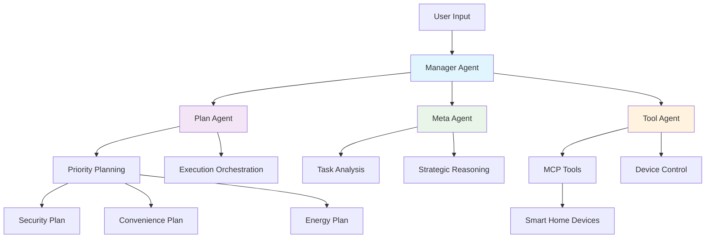

# Tài liệu Hệ thống MAS-Planning

Chào mừng bạn đến với bộ tài liệu toàn diện của hệ thống **MAS-Planning** (Multi-Agent Smart Home Planning) - một giải pháp automation thông minh cho smart home sử dụng công nghệ multi-agent và AI tiên tiến.

## 📚 Mục lục Tài liệu

### [01. Kiến Trúc Tổng Quan](./01_Kiến_Trúc_Tổng_Quan.md)
- **Tổng quan hệ thống**: Giới thiệu về MAS-Planning và mục tiêu chính
- **Kiến trúc Multi-Agent**: Cấu trúc và tương tác giữa các agents
- **Workflow luồng xử lý**: Các quy trình xử lý chính
- **Thiết kế kiến trúc**: Nguyên tắc thiết kế và scalability
- **External Integrations**: Tích hợp với các dịch vụ bên ngoài

### [02. Manager Agent](./02_Manager_Agent.md)
- **Vai trò trung tâm**: Manager Agent như central coordinator
- **Query Analysis Engine**: Phân tích và phân loại user queries
- **Intelligent Routing**: Logic routing thông minh
- **Session Management**: Quản lý conversation và state
- **Performance Optimizations**: Tối ưu hiệu suất và caching

### [03. Plan Agent](./03_Plan_Agent.md)
- **Strategic Planning**: Tạo kế hoạch automation thông minh
- **Priority-Based Planning**: 3 loại plan (Security, Convenience, Energy)
- **Plan Execution**: Orchestration và workflow management
- **Sub-Agent Integration**: Tích hợp với Meta và Tool Agents
- **API Integration**: Kết nối với external planning APIs

### [04. Meta Agent](./04_Meta_Agent.md)
- **Analytical Intelligence**: Engine phân tích và reasoning
- **Task Decomposition**: Phân tích và chia nhỏ tasks phức tạp
- **XML Processing**: Xử lý structured data từ LLM responses
- **Strategic Guidance**: Cung cấp strategic recommendations
- **Multi-Modal Reasoning**: Các chế độ reasoning khác nhau

### [05. Tool Agent](./05_Tool_Agent.md)
- **Execution Engine**: Thực thi concrete device control actions
- **MCP Integration**: Tích hợp với Model Context Protocol
- **Authentication Framework**: Quản lý token-based authentication
- **Device Coordination**: Điều phối multi-device operations
- **Error Recovery**: Xử lý lỗi và recovery mechanisms

### [06. MCP Integration & External Services](./06_MCP_Integration_External_Services.md)
- **Model Context Protocol**: Chi tiết về MCP integration
- **Authentication & Security**: Bảo mật và xác thực
- **External API Integration**: Tích hợp với OXII API, Google Cloud
- **Data Storage & Caching**: Redis và session management
- **Health Check System**: Monitoring và health checking

### [07. Development Guide & Best Practices](./07_Development_Guide.md)
- **Development Environment**: Setup và configuration
- **Code Structure**: Organization và coding standards
- **Testing Strategy**: Unit, integration, và E2E testing
- **Deployment Guide**: Local, Docker, và production deployment
- **Debugging & Troubleshooting**: Debug tools và common issues

## 🎯 Hệ thống MAS-Planning

MAS-Planning là một hệ thống multi-agent automation tiên tiến cho smart home, được thiết kế để:

### **Tính năng chính**
- **🏗️ Strategic Planning**: Tạo kế hoạch automation thông minh và có tổ chức
- **🤖 Multi-Agent Architecture**: Coordination giữa các specialized agents
- **🔧 Real-time Control**: Điều khiển thiết bị smart home real-time
- **🧠 AI-Powered**: Sử dụng Google Vertex AI cho decision making
- **🔌 MCP Integration**: Tích hợp với Model Context Protocol
- **🔐 Enterprise Security**: Token-based authentication và secure communication

### **Kiến trúc Agents**



### **Technology Stack**
- **Backend**: Python 3.8+, FastAPI, LangGraph
- **AI/ML**: Google Cloud Vertex AI, Gemini 2.5 Pro
- **Integration**: Model Context Protocol (MCP)
- **Storage**: Redis for caching và session management
- **Deployment**: Docker, Kubernetes support

## 🚀 Quick Start

### **1. Cài đặt nhanh**
```bash
git clone https://github.com/BaoBao112233/MAS-Planning.git
cd MAS-Planning
python -m venv .venv
source .venv/bin/activate  # Linux/Mac
pip install -r requirements-dev.txt
```

### **2. Cấu hình**
```bash
cp .env.template .env
cp service-account.json.example service-account.json
# Edit .env với your configuration
```

### **3. Chạy hệ thống**
```bash
python main.py
# Server runs on http://localhost:9000
```

### **4. Test API**
```bash
curl -X POST "http://localhost:9000/ai/chat" \
  -H "Content-Type: application/json" \
  -d '{"conversationId":"test","sessionId":"s1","message":"Create smart home plan","channelId":"test","socialNetworkId":"test","pageName":"test"}'
```

## 📋 Workflow Cơ bản

### **1. Plan Creation**
```
User Request → Manager Agent → Plan Agent → 3 Priority Plans → User Selection
```

### **2. Plan Execution**
```
Selected Plan → Meta Agent Analysis → Tool Agent Execution → Status Updates
```

### **3. Device Control**
```
Control Command → Tool Agent → MCP Server → Device API → Action Result
```

## 🔧 Cấu hình Environment

### **Biến môi trường chính**
```bash
# Application
APP_NAME="MAS Planning System"
APP_PORT=9000

# Google Cloud
GOOGLE_CLOUD_PROJECT="your-project-id"
GOOGLE_CLOUD_LOCATION="us-central1"
MODEL_NAME="gemini-2.5-pro"

# MCP Server
MCP_SERVER_URL="http://localhost:9031"

# Redis
REDIS_HOST="localhost"
REDIS_PORT=6379
```

## 🛡️ Security Features

- **🔐 Token-based Authentication**: Secure MCP tool access
- **🛡️ Input Validation**: Comprehensive input sanitization
- **🔒 Encrypted Communication**: Secure API communication
- **📝 Audit Logging**: Complete operation tracking
- **🚫 No Credential Storage**: Tokens passed through, never stored

## 📊 Monitoring & Analytics

- **⚡ Performance Metrics**: Response times và success rates
- **🏥 Health Checks**: System và service monitoring
- **📈 Usage Analytics**: User behavior và interaction patterns
- **🚨 Error Tracking**: Comprehensive error logging và alerting

## 🤝 Contributing

Chúng tôi welcome contributions! Vui lòng:

1. Fork repository
2. Tạo feature branch
3. Follow coding standards trong Development Guide
4. Write comprehensive tests
5. Submit pull request

## 📞 Support & Contact

- **Repository**: [GitHub - MAS-Planning](https://github.com/BaoBao112233/MAS-Planning)
- **Author**: BaoBao112233
- **Email**: kevinbao15072002@gmail.com
- **Issues**: [GitHub Issues](https://github.com/BaoBao112233/MAS-Planning/issues)

## 📄 License

MIT License - xem LICENSE file cho chi tiết.

---

## 🎉 Kết luận

Hệ thống MAS-Planning đại diện cho sự tiến bộ trong smart home automation, kết hợp:

- **Intelligent Planning**: AI-powered strategic planning
- **Multi-Agent Coordination**: Sophisticated agent collaboration
- **Real-world Integration**: Practical device control capabilities
- **Enterprise Security**: Production-ready security features
- **Scalable Architecture**: Design cho growth và expansion

Tài liệu này cung cấp roadmap hoàn chỉnh để hiểu, develop, và deploy hệ thống MAS-Planning. Mỗi document đi sâu vào technical details và best practices cho từng component.

**Chúc bạn thành công trong việc implement và customize MAS-Planning cho smart home needs của bạn!** 🏠✨